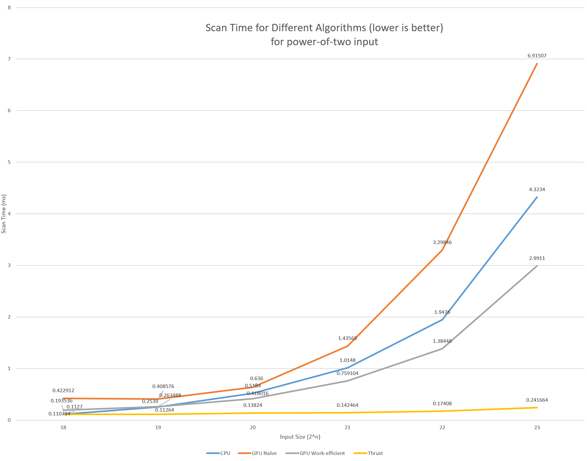
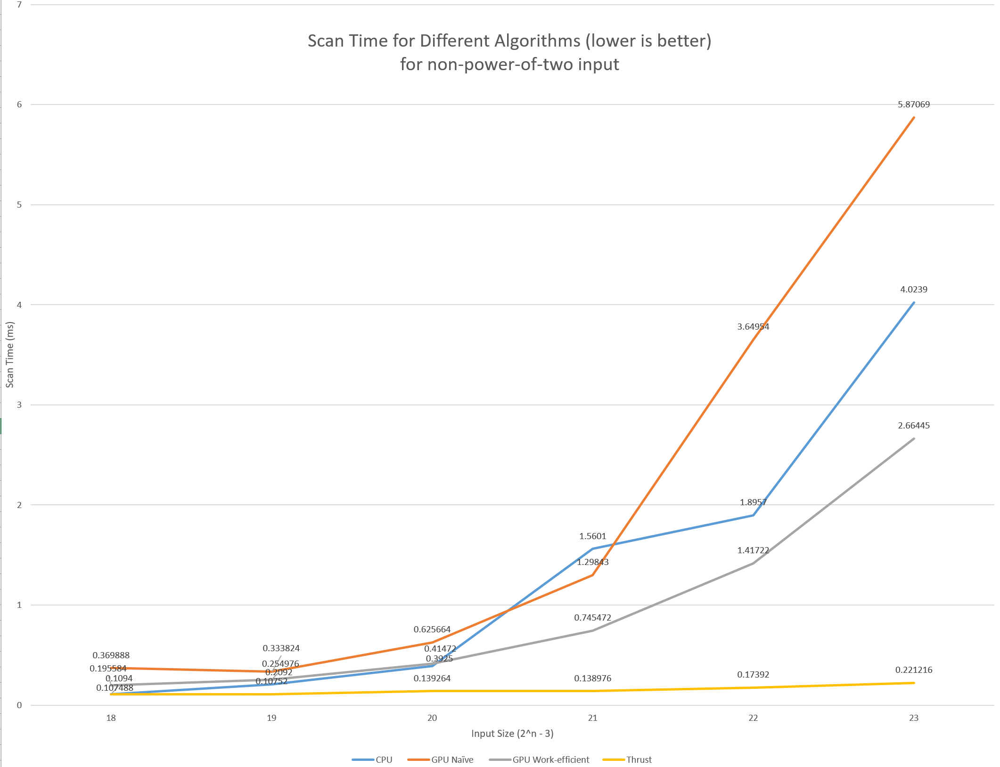
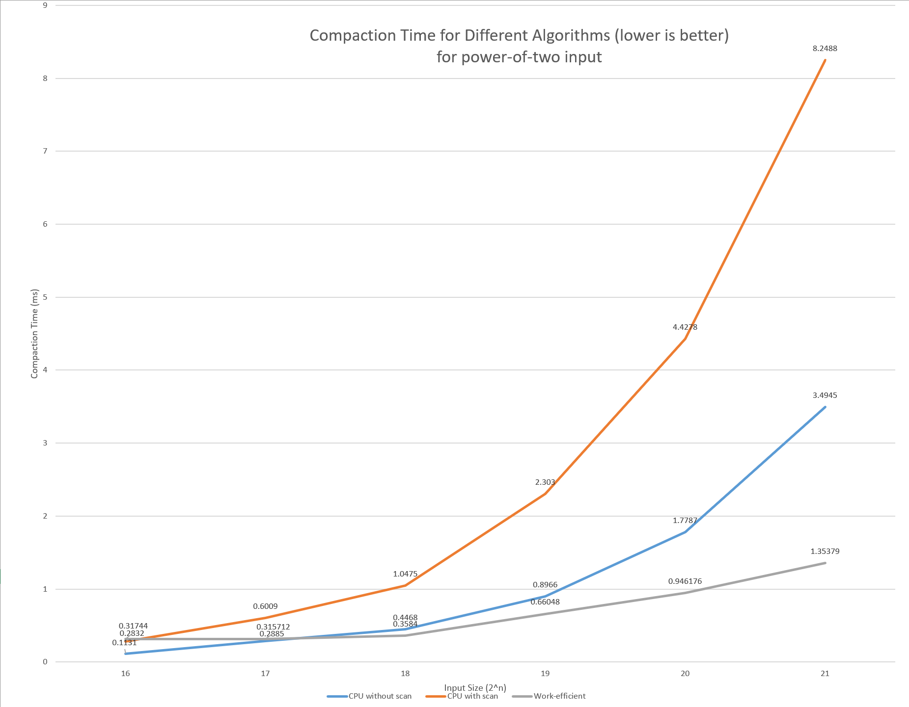
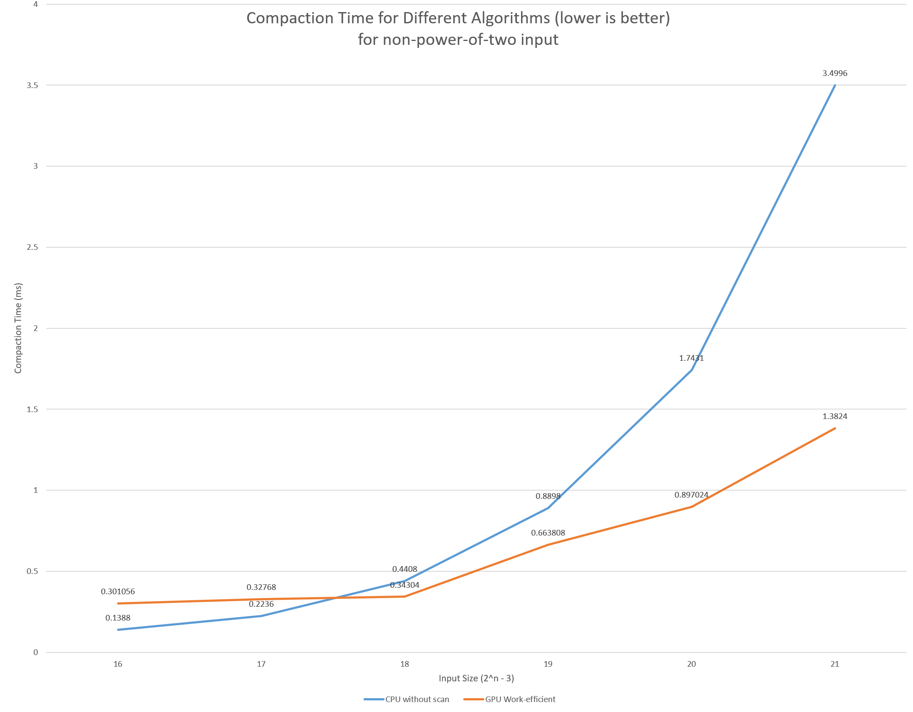
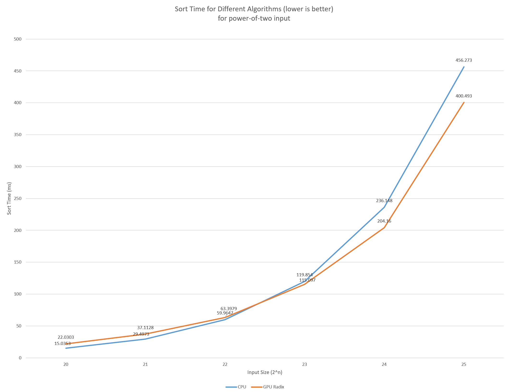
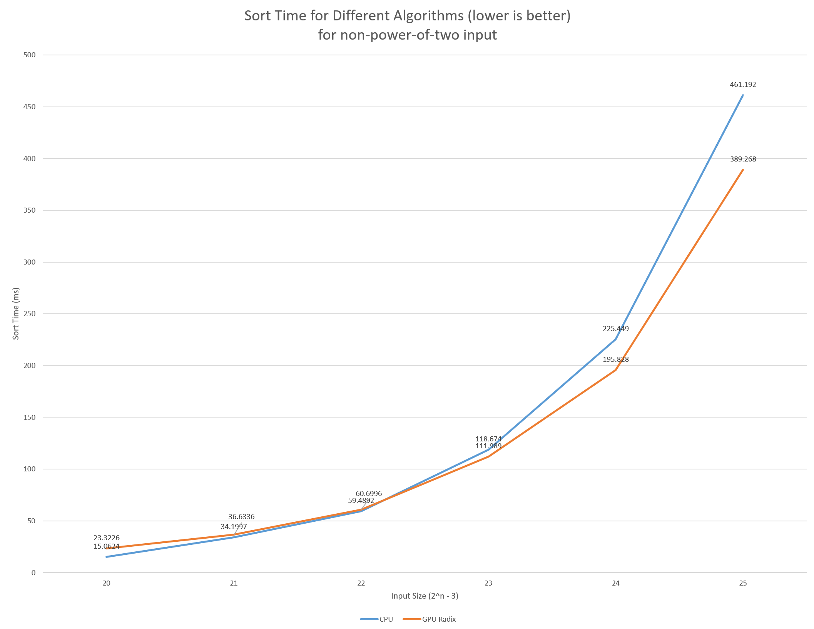
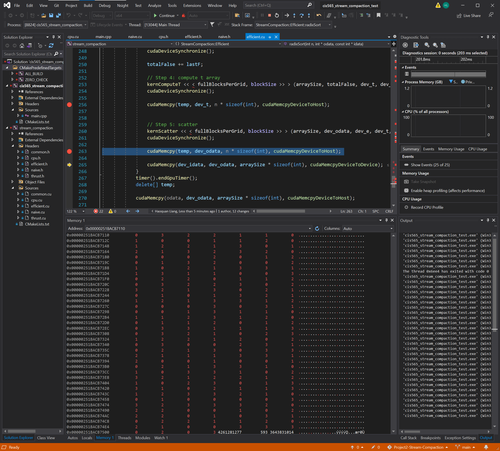

# CUDA Stream Compaction
**University of Pennsylvania, CIS 565: GPU Programming and Architecture, Project 2**

* Haoquan Liang
  * [LinkedIn](https://www.linkedin.com/in/leohaoquanliang/)
* Tested on: Windows 10, Ryzen 7 5800X 8 Core 3.80 GHz, NVIDIA GeForce RTX 3080 Ti 12 GB

# Table of Contents  
[Features](#features)
[Performance Analysis](#perf_anal)  
[Extra Credit](#ec)
[Debugging Notes/Example](#debug)
[Output Sample](#output)
[Future Improvement](#future)

# Features
<a name="features"/>

* CPU Scan 
* CPU Compaction with/without Scan
* GPU Naive Scan
* GPU Work-efficient Scan
* GPU Compatction with Scan
* Thrust Scan/Compaction
* GPU Scan Optimization (Extra Credit)
* Radix Sort (Extra Credit)

# Performance Analysis 
<a name="perf_anal"/>
## Scan 
   


Thrust's implementation is always the most efficient method. GPU work-efficient scan starts outperforming the CPU when the input size is greater than 2^20. GPU naive method is always the least efficient method.     
This is totally expected, as there are more overheads on the GPU side, and the benefits of parallelism only starts to show up when the input size is big enough.

## Compaction
   


CPU with scan is the least efficient in this case, which makes sense since it actually did a lot of extra work without the benefit of parallelism. GPU work-efficient compaction starts outperforming the regular CPU implementation when the input size is greater than 2^18. This is early than the scan case, because compaction can take a lot of advantages from parallelism.

## Sort 
   


The CPU side uses the std::sort, which uses the Introsort algorithm that has a time complexity of O(N log(N)). It is already a very efficient sorting algorithm, but the GPU's Radix sort still manages to beat it when the input size is more than 2^23.

# Extra Credit
<a name="ec"/>
### Why is My GPU Approach So Slow?
There are many reasons for the GPU approach to be slower, and following are some of my ideas:
* There are way more computation overheads for the GPU scan, which is due to the nature of the algorithm being used. There isn't really any way to improve it.
* We are using Global memory in our implementation, instead of Shared Memory that is a lot faster. 
* In both Up/Down Sweep, when d value is high, there will be a lot of threads idling. I added code to make sure that if the data at that index won't be checked for the current d value, it should exit early. There are further improvements that can be done by improving the locality of the data. 
* Block size can affect the performance. I tried varying the block size based on the input size, setting a very small block size, and setting a very big block size. Unfortunately, all the above methods decreased the performance. I also checked the block size used by Thrust, and it seems to be using 128. So I used 128 in my implementation too. It will be interesting to dive deeper and learn the reasons in the future.  

### Radix Sort 
I implemented the radix sort and wrote a test case using the std::sort on the CPU side. The algorithm works perfectly and start outperforming the CPU side when input is greater than 2^23. 
In main.cpp, I constructed array a (power-of-two size) and array b (non-power-of-two size), and I called StreamCompaction::Efficient::radixSort() to generate the result, and print whether the result matches the result from the CPU. 
This is the result
```
*****************************
** RADIX SORT TESTS **
*****************************
    [  71  23  76   5  97   9  58  85  81  38  37  70   2 ...  80   0 ]
==== cpu std::sort, power-of-two ====
   elapsed time: 1086.39ms    (std::chrono Measured)
    [   0   0   0   0   0   0   0   0   0   0   0   0   0 ...  99  99 ]
==== cpu std::sort, non-power-of-two ====
   elapsed time: 1067.79ms    (std::chrono Measured)
    [   0   0   0   0   0   0   0   0   0   0   0   0   0 ...  99  99 ]
==== radix sort, power-of-two ====
   elapsed time: 803.583ms    (CUDA Measured)
    passed
==== radix sort, non-power-of-two ====
   elapsed time: 785.894ms    (CUDA Measured)
    passed
```
for these lines:
```
    printf("\n");
    printf("*****************************\n");
    printf("** RADIX SORT TESTS **\n");
    printf("*****************************\n");
    // Sort Test
    genArray(SIZE - 1, a, 100);
    printArray(SIZE, a, true);

    zeroArray(SIZE, b);
    printDesc("cpu std::sort, power-of-two");
    StreamCompaction::CPU::sort(SIZE, b, a);
    printElapsedTime(StreamCompaction::CPU::timer().getCpuElapsedTimeForPreviousOperation(), "(std::chrono Measured)");
    printArray(SIZE, b, true);

    zeroArray(SIZE, c);
    printDesc("cpu std::sort, non-power-of-two");
    StreamCompaction::CPU::sort(NPOT, c, a);
    printElapsedTime(StreamCompaction::CPU::timer().getCpuElapsedTimeForPreviousOperation(), "(std::chrono Measured)");
    printArray(NPOT, c, true);

    zeroArray(SIZE, d);
    printDesc("radix sort, power-of-two");
    StreamCompaction::Efficient::radixSort(SIZE, d, a);
    printElapsedTime(StreamCompaction::Efficient::timer().getGpuElapsedTimeForPreviousOperation(), "(CUDA Measured)");
    printCmpResult(SIZE, b, d);

    zeroArray(SIZE, d);
    printDesc("radix sort, non-power-of-two");
    StreamCompaction::Efficient::radixSort(NPOT, d, a);
    printElapsedTime(StreamCompaction::Efficient::timer().getGpuElapsedTimeForPreviousOperation(), "(CUDA Measured)");
    printCmpResult(NPOT,c, d);

```


# Debugging Notes/Example
<a name="debug"/>
For this project, I mainly used the watch and memory tool from the VS debugger. I want to clearly see the changes of the array at each step, so I copy the result from the Kernel to a local CPU array, use the watch to find out its memory, and then use the memory tool to see if it's the desired result. 
Following is an example: 
   
My Radix sort is generating a wrong result, so I use the above method to go through each step. At step 5, the result wasn't expected (it should have all the 0s and 2s followed by 1s and 3s but instead they are all mixed together). I figured out it's the KernScatter function that didn't generate the correct result, so I went to check for it and find the bug. 

# Output Sample
<a name="output"/>

For input size 2^26:
```

****************
** SCAN TESTS **
****************
    [  21  17  24   5  47  20   8  18  12  37  41  44  21 ...  25   0 ]
==== cpu scan, power-of-two ====
   elapsed time: 36.0359ms    (std::chrono Measured)
    [   0  21  38  62  67 114 134 142 160 172 209 250 294 ... 1643665856 1643665881 ]
==== cpu scan, non-power-of-two ====
   elapsed time: 35.3576ms    (std::chrono Measured)
    [   0  21  38  62  67 114 134 142 160 172 209 250 294 ... 1643665797 1643665811 ]
    passed
==== naive scan, power-of-two ====
   elapsed time: 53.4917ms    (CUDA Measured)
    passed
==== naive scan, non-power-of-two ====
   elapsed time: 47.9857ms    (CUDA Measured)
    passed
==== work-efficient scan, power-of-two ====
   elapsed time: 24.1193ms    (CUDA Measured)
    passed
==== work-efficient scan, non-power-of-two ====
   elapsed time: 21.9279ms    (CUDA Measured)
    passed
==== thrust scan, power-of-two ====
   elapsed time: 0.766976ms    (CUDA Measured)
    passed
==== thrust scan, non-power-of-two ====
   elapsed time: 0.86528ms    (CUDA Measured)
    passed

*****************************
** STREAM COMPACTION TESTS **
*****************************
    [   3   2   1   3   3   0   3   2   2   1   1   0   2 ...   2   0 ]
==== cpu compact without scan, power-of-two ====
   elapsed time: 128.336ms    (std::chrono Measured)
    [   3   2   1   3   3   3   2   2   1   1   2   3   2 ...   2   2 ]
    passed
==== cpu compact without scan, non-power-of-two ====
   elapsed time: 122.404ms    (std::chrono Measured)
    [   3   2   1   3   3   3   2   2   1   1   2   3   2 ...   2   2 ]
    passed
==== cpu compact with scan ====
   elapsed time: 271.842ms    (std::chrono Measured)
    [   3   2   1   3   3   3   2   2   1   1   2   3   2 ...   2   2 ]
    passed
==== work-efficient compact, power-of-two ====
   elapsed time: 33.268ms    (CUDA Measured)
    passed
==== work-efficient compact, non-power-of-two ====
   elapsed time: 33.4285ms    (CUDA Measured)
    passed

*****************************
** RADIX SORT TESTS **
*****************************
    [  34  42  27   4  19  27   7   9  22  13  49  20  41 ...   8   0 ]
==== cpu std::sort, power-of-two ====
   elapsed time: 946.368ms    (std::chrono Measured)
    [   0   0   0   0   0   0   0   0   0   0   0   0   0 ...  49  49 ]
==== cpu std::sort, non-power-of-two ====
   elapsed time: 908.604ms    (std::chrono Measured)
    [   0   0   0   0   0   0   0   0   0   0   0   0   0 ...  49  49 ]
==== radix sort, power-of-two ====
   elapsed time: 846.838ms    (CUDA Measured)
    passed
==== radix sort, non-power-of-two ====
   elapsed time: 815.581ms    (CUDA Measured)
    passed
```

# Future Improvement
<a name="future"/>
* Using Shared Memory for GPU scan
* Improve the locality of the array to help retiring more idling threads
* Learn more about Thrust's implementation (why it is so efficient)