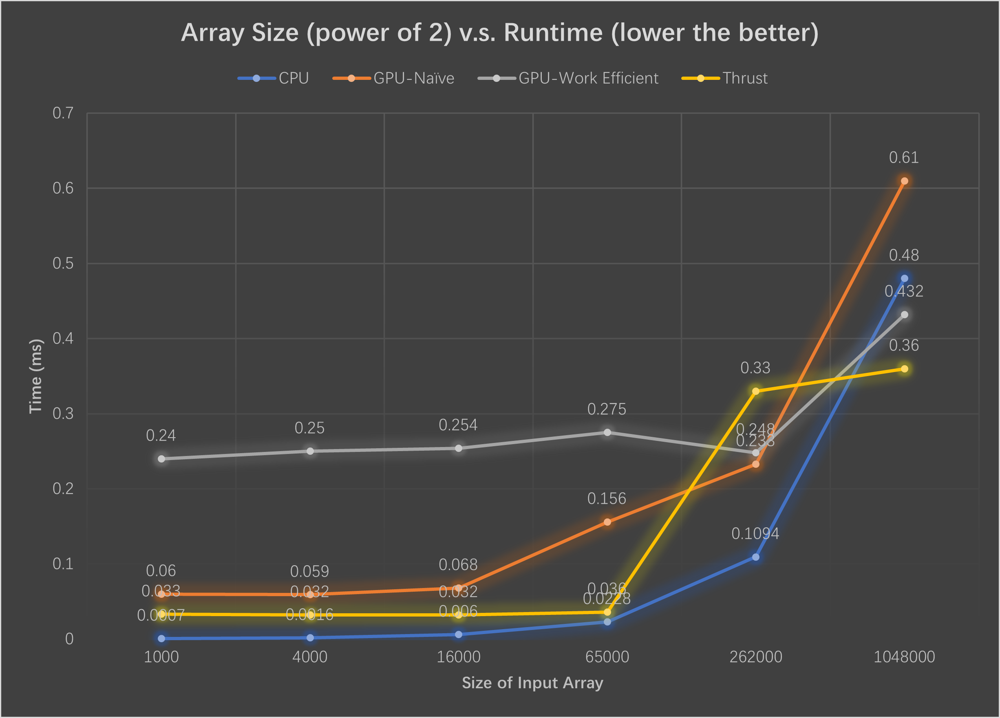
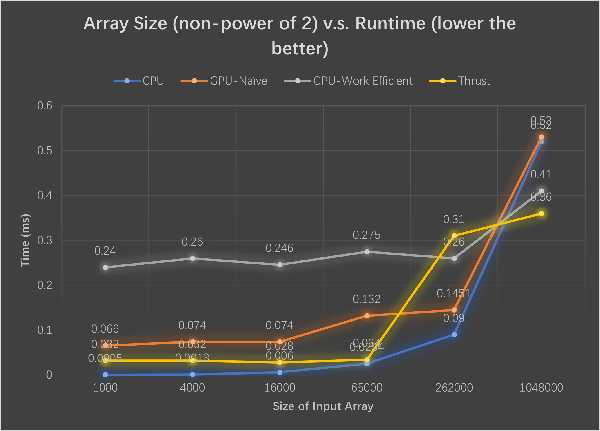

**University of Pennsylvania, CIS 565: GPU Programming and Architecture, Project 2**
CUDA Stream Compaction
======================

* Runshi Gu
  * [LinkedIn](https://www.linkedin.com/in/runshi-gu-445648194/)
* Tested on: Windows 10, AMD Ryzen 7 5800X 8-Core Processor @ 3.80 GHz 32GB, RTX3070 24538MB, Personal


## Features Implemented
* CPU scan and stream compaction
* Naive GPU scan
* Work-Efficient GPU scan (upsweep and downsweep) with support for arbitrary array length
* GPU compaction using scan

## Features TODO
* Radix Sort
* Share Memory & Hardware Optimization

## Performance Analysis





* Since I didn't implement optimization of using share memory, our GPU based implementations (Naive and Work-Efficient) are bottlenecked by global memory reading speed at low array sizes. When the array size exceed threshold (size 262000), the CPU implementations' runtime increases dramatically while GPU implementation have less increase due to the benefit of parallel processing.

### Test output

```
****************
** SCAN TESTS **
****************
    [  47  21  42  36  31  47  20  19  26  13  42  17  28 ...  44   0 ]
==== cpu scan, power-of-two ====
   elapsed time: 0.0131ms    (std::chrono Measured)
    [   0  47  68 110 146 177 224 244 263 289 302 344 361 ... 802137 802181 ]
==== cpu scan, non-power-of-two ====
   elapsed time: 0.0117ms    (std::chrono Measured)
    [   0  47  68 110 146 177 224 244 263 289 302 344 361 ... 802105 802112 ]
    passed
==== naive scan, power-of-two ====
   elapsed time: 0.126048ms    (CUDA Measured)
    passed
==== naive scan, non-power-of-two ====
   elapsed time: 0.195296ms    (CUDA Measured)
    passed
==== work-efficient scan, power-of-two ====
   elapsed time: 0.274528ms    (CUDA Measured)
    passed
==== work-efficient scan, non-power-of-two ====
   elapsed time: 0.251904ms    (CUDA Measured)
    passed
==== thrust scan, power-of-two ====
   elapsed time: 0.031008ms    (CUDA Measured)
    passed
==== thrust scan, non-power-of-two ====
   elapsed time: 0.027648ms    (CUDA Measured)
    passed

*****************************
** STREAM COMPACTION TESTS **
*****************************
    [   3   3   2   0   3   1   0   3   2   3   0   1   0 ...   0   0 ]
==== cpu compact without scan, power-of-two ====
   elapsed time: 0.0533ms    (std::chrono Measured)
    [   3   3   2   3   1   3   2   3   1   1   1   1   1 ...   1   1 ]
    passed
==== cpu compact without scan, non-power-of-two ====
   elapsed time: 0.0506ms    (std::chrono Measured)
    [   3   3   2   3   1   3   2   3   1   1   1   1   1 ...   1   1 ]
    passed
==== cpu compact with scan ====
   elapsed time: 0.1308ms    (std::chrono Measured)
    [   3   3   2   3   1   3   2   3   1   1   1   1   1 ...   1   1 ]
    passed
==== work-efficient compact, power-of-two ====
   elapsed time: 0.878368ms    (CUDA Measured)
    passed
==== work-efficient compact, non-power-of-two ====
   elapsed time: 0.389664ms    (CUDA Measured)
    passed
Press any key to continue . . .
```