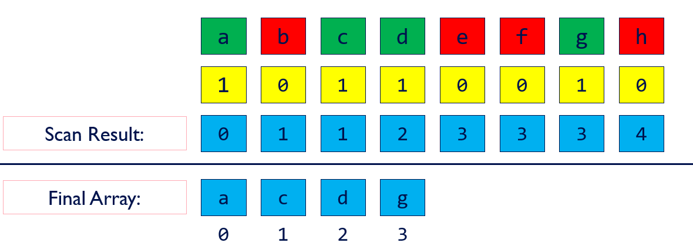
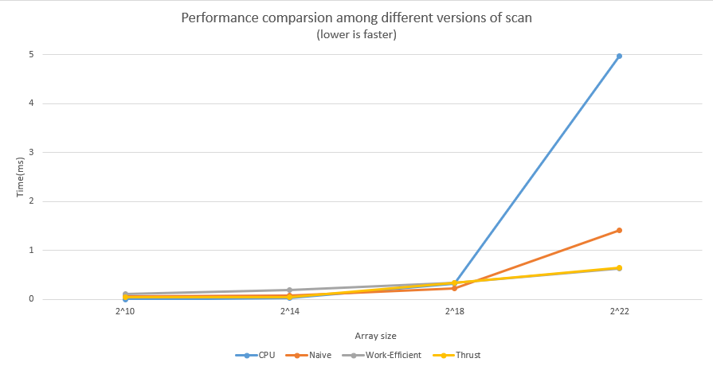
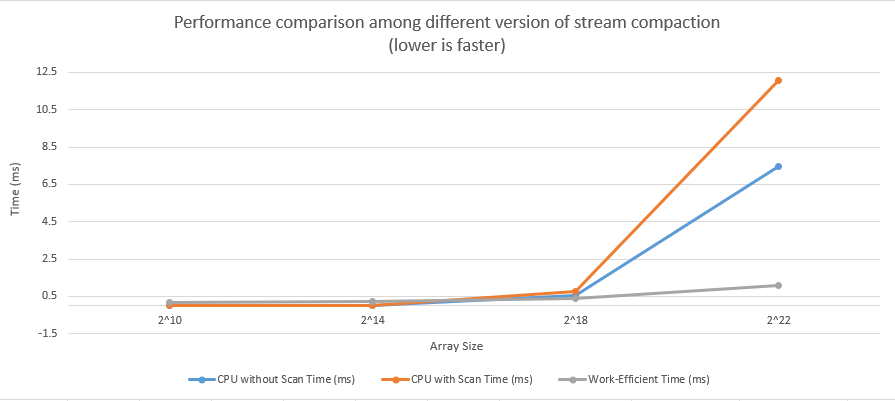

CUDA Stream Compaction
======================

**University of Pennsylvania, CIS 565: GPU Programming and Architecture, Project 2**

* Shineng Tang
  * [LinkedIn](https://www.linkedin.com/in/shineng-t-224192195/)
* Tested on: Windows 11, i9-10900k @3.7GHz 32GB, RTX 3090 24GB


# Project Description
This project implements a few different versions of the **Scan** (_Prefix Sum_) algorithm and stream compaction in CUDA.




## Main Features:
* `StreamCompaction::CPU::scan`: compute an exclusive prefix sum.
* `StreamCompaction::CPU::compactWithoutScan`: stream compaction without using
  the `scan` function.
* `StreamCompaction::CPU::compactWithScan`: stream compaction using the `scan`
  function. 
* `StreamCompaction::Naive::scan`: A naive parallel GPU scan
* `StreamCompaction::Efficient::scan`: A **work-efficient** parallel GPU scan using _upsweep_ and _downsweep_
* `StreamCompaction::Thrust::scan`: A short function which wraps a call to the **Thrust** library
* `StreamCompaction::Efficient::compact`: A string compaction funtion in CUDA

## Extra Credit Features:
* `StreamCompaction::Efficient::radixSort`: I implemented CUDA based radix sort. It is noticably faster than `std::sort` when dealing with large size array. The test cases are shown at the bottom of the **Test Outputs** below.
* Threads optimization: By rearranging the usage of the threads, and reducing the blockcount when doing upsweep and downsweep, the performance increases dramatically. I set a macro to toggle the thread-optimization mode.


# Test Outputs 
```

****************
** SCAN TESTS **
****************
    [  47  21  28  13   2  26   1  14   4  49  25  20  43 ...  15   0 ]
==== cpu scan, power-of-two ====
   elapsed time: 2.729ms    (std::chrono Measured)
    [   0  47  68  96 109 111 137 138 152 156 205 230 250 ... 51332490 51332505 ]
==== cpu scan, non-power-of-two ====
   elapsed time: 2.7305ms    (std::chrono Measured)
    [   0  47  68  96 109 111 137 138 152 156 205 230 250 ... 51332413 51332419 ]
    passed
==== naive scan, power-of-two ====
   elapsed time: 19.9673ms    (CUDA Measured)
    [   0  47  68  96 109 111 137 138 152 156 205 230 250 ... 51332490 51332505 ]
    passed
==== naive scan, non-power-of-two ====
   elapsed time: 18.4846ms    (CUDA Measured)
    passed
==== work-efficient scan, power-of-two ====
   elapsed time: 0.527424ms    (CUDA Measured)
    [   0  47  68  96 109 111 137 138 152 156 205 230 250 ... 51332490 51332505 ]
    passed
==== work-efficient scan, non-power-of-two ====
   elapsed time: 0.519136ms    (CUDA Measured)
    [   0  47  68  96 109 111 137 138 152 156 205 230 250 ... 51332413 51332419 ]
    passed
==== thrust scan, power-of-two ====
   elapsed time: 0.51376ms    (CUDA Measured)
    [   0  47  68  96 109 111 137 138 152 156 205 230 250 ... 51332490 51332505 ]
    passed
==== thrust scan, non-power-of-two ====
   elapsed time: 0.469344ms    (CUDA Measured)
    [   0  47  68  96 109 111 137 138 152 156 205 230 250 ... 51332413 51332419 ]
    passed

*****************************
** STREAM COMPACTION TESTS **
*****************************
    [   1   3   0   1   0   2   1   0   0   1   1   0   1 ...   3   0 ]
==== cpu compact without scan, power-of-two ====
   elapsed time: 4.1334ms    (std::chrono Measured)
    [   1   3   1   2   1   1   1   1   3   3   2   2   2 ...   2   3 ]
    passed
==== cpu compact without scan, non-power-of-two ====
   elapsed time: 4.115ms    (std::chrono Measured)
    [   1   3   1   2   1   1   1   1   3   3   2   2   2 ...   2   1 ]
    passed
==== cpu compact with scan ====
   elapsed time: 6.5739ms    (std::chrono Measured)
    [   1   3   1   2   1   1   1   1   3   3   2   2   2 ...   2   3 ]
    passed
==== work-efficient compact, power-of-two ====
   elapsed time: 0.602784ms    (CUDA Measured)
    [   1   3   1   2   1   1   1   1   3   3   2   2   2 ...   2   3 ]
    passed
==== work-efficient compact, non-power-of-two ====
   elapsed time: 0.604032ms    (CUDA Measured)
    [   1   3   1   2   1   1   1   1   3   3   2   2   2 ...   2   1 ]
    passed

*****************************
** RADIX SORT TESTS **
*****************************
==== radix sort, power-of-two ====
   elapsed time: 6.89866ms    (CUDA Measured)
    [   0   0   0   0   0   0   0   0   0   0   0   0   0 ...  49  49 ]
   elapsed time: 34.7704ms    (std::chrono Measured)
    passed
==== radix sort, non-power-of-two ====
   elapsed time: 6.59078ms    (CUDA Measured)
    [   0   0   0   0   0   0   0   0   0   0   0   0   0 ...  49  49 ]
   elapsed time: 35.2076ms    (std::chrono Measured)
    passed
```
# Performance Analysis



For the **scan algorithm**, I notice that when dealing with relatively small-sized arrays, the cpu version is slightly faster than any gpu implementation, even Thrust. When I increase the size of the array, for example, at array size 2^14, the supposedly faster implementation is slower than any other ones. However, when the array size reaches a bigger number 2^22, the performance of the work-efficent scan is already fairly close to the thrust function. Another thing I notice is that the naive GPU scan does not surpass the CPU scan until approximately 2^19. This is because of the usage of global memory and no threads optimization which leads to divergency.



For the **stream compaction**, the pattern of the chart is similar to the scan function. When dealing with large-sized data, GPU is always faster.