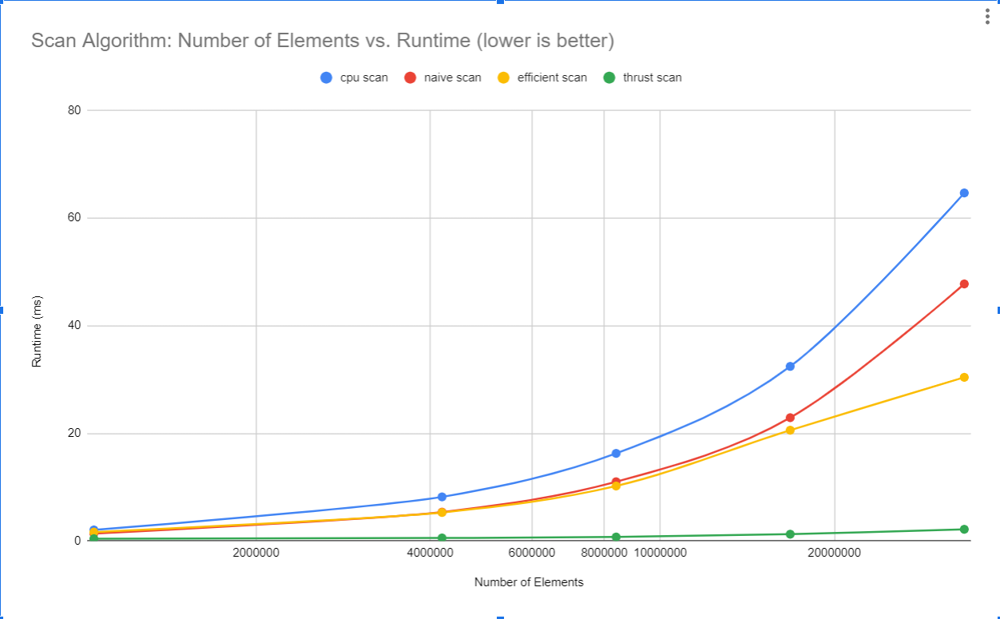

CUDA Stream Compaction
======================

**University of Pennsylvania, CIS 565: GPU Programming and Architecture, Project 2**

* Yiyang Chen
  * [LinkedIn](https://www.linkedin.com/in/yiyang-chen-6a7641210/), [personal website](https://cyy0915.github.io/)
* Tested on: Windows 10, i5-8700k @ 3.7GHz, GTX 1080, personal computer

## Features
I implemented part 1 to part 5

For part 5, I optimized it so that when array size is large enough, efficient is always faster than naive, and naive is always faster than cpu. I did it by optimize the number of thread in up sweep and down sweep

## Performance Analysis
I have roughly optimized the block sizes. I found that 128 is ok.




See the above graphs, notice the axis

* **Phenomena:** In `scan` function, when the array length is large enough (>2^18), for runtime, cpu > naive > efficient > thrust. And in `compact` function, also when the array length is large enough, for runtime, cpu > efficient. However, when the array length is small, cpu < naive < thrust < efficient.

* **Explanation:**
  * cpu: O(n) time complexity, very normal. I think the bottleneck is computation.
  * naive: run parallel in GPU, so it's faster than cpu implementation when the array length is large. I think when the array length is small the bottleneck is memory I/O, so it's slower than cpu.
  * efficient: run parallel in GPU and don't need two buffers, so it's faster than naive when the array length is large. I think when the array length is small the bottleneck is also memory I/O, and it invoke more device functions compared to naive implementation, so it's even slower than naive.


```****************
** SCAN TESTS **
****************
    [  23  47  43   2   9  23  22  34  41  24  17   1   6 ...  40   0 ]
==== cpu scan, power-of-two ====
   elapsed time: 1.4016ms    (std::chrono Measured)
    [   0  23  70 113 115 124 147 169 203 244 268 285 286 ... 25709761 25709801 ]
==== cpu scan, non-power-of-two ====
   elapsed time: 1.4073ms    (std::chrono Measured)
    [   0  23  70 113 115 124 147 169 203 244 268 285 286 ... 25709686 25709735 ]
    passed
==== naive scan, power-of-two ====
   elapsed time: 0.76112ms    (CUDA Measured)
    passed
==== naive scan, non-power-of-two ====
   elapsed time: 0.763008ms    (CUDA Measured)
    passed
==== work-efficient scan, power-of-two ====
   elapsed time: 0.476032ms    (CUDA Measured)
    passed
==== work-efficient scan, non-power-of-two ====
   elapsed time: 0.479264ms    (CUDA Measured)
    passed
==== thrust scan, power-of-two ====
   elapsed time: 0.191008ms    (CUDA Measured)
    passed
==== thrust scan, non-power-of-two ====
   elapsed time: 0.213728ms    (CUDA Measured)
    passed

*****************************
** STREAM COMPACTION TESTS **
*****************************
    [   1   1   3   2   1   3   2   2   3   2   3   1   0 ...   2   0 ]
==== cpu compact without scan, power-of-two ====
   elapsed time: 2.1584ms    (std::chrono Measured)
    [   1   1   3   2   1   3   2   2   3   2   3   1   3 ...   1   2 ]
    passed
==== cpu compact without scan, non-power-of-two ====
   elapsed time: 2.0913ms    (std::chrono Measured)
    [   1   1   3   2   1   3   2   2   3   2   3   1   3 ...   3   3 ]
    passed
==== cpu compact with scan ====
   elapsed time: 5.7503ms    (std::chrono Measured)
    [   1   1   3   2   1   3   2   2   3   2   3   1   3 ...   1   2 ]
    passed
==== work-efficient compact, power-of-two ====
   elapsed time: 0.618016ms    (CUDA Measured)
    passed
==== work-efficient compact, non-power-of-two ====
   elapsed time: 0.636352ms    (CUDA Measured)
    passed```