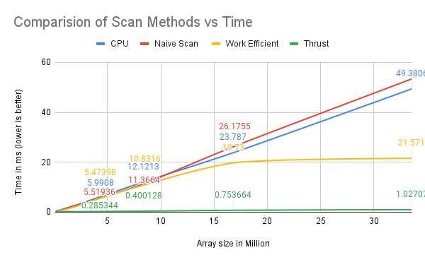
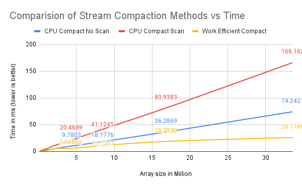

CUDA Stream Compaction
======================

**University of Pennsylvania, CIS 565: GPU Programming and Architecture, Project 2**

* Yilin Liu
  * [LinkedIn](https://www.linkedin.com/in/yilin-liu-9538ba1a5/)
  * [Personal website](https://www.yilin.games)
* Tested on personal laptop:
  - Windows 10, Intel(R) Core(TM), i7-10750H CPU @ 2.60GHz 2.59 GHz, RTX 2070 Max-Q 8GB

## Features
This project uses CUDA to implement and improve a number of parallelized scan and stream compaction algorithms. Following features have been implemented:

- Scan: calculate the prefix sum (using arbitrary operator) of an array

  - CPU scan with/without simulating parallelized scan 

  - GPU naive scan 

  - GPU work-efficient scan 

  - GPU scan using `thrust::exclusive_scan` 

- Stream compaction: remove elements that unmeet specific conditions from an array, and keep the rest compact in memory

  - CPU stream compaction with/without CPU scan

  - GPU stream compaction using the work-efficient scan
  


## Reflection

* Based on array size of 33554432 (2^25), I optimized each method by selecting the block size which could provide best performance.

  | Methods  | Optimized Block Size |
  | ------------- | ------------- |
  | Naive Scan  | 128  |
  | Work Efficient  | 512  |
  | Thrust  | 512  |


* Based on the optimized block size, I compare all of these GPU Scan implementations (Naive, Work-Efficient, and Thrust) to the serial CPU version of scan. 
  
  ||
  |:--:| 
  | *Comparision of Scan Methods vs Time* |
* From the figure above, we can see that there is no significant differences between CPU, Naive and Work Efficient method while the array size is less than 15M, although Work Efficient method is slightly faster than the other two. However, as the array size increases, work efficient method is much faster while other two continue to grow linearly. On the other side, the Thrust method has always been the fastest method and take almost constant time as array increases. 
* The naive and work efficient method are slow since GPU has to read from global memory, which is very costly. The reason why Thrust library is super fast could probably be that it saves copy/paste cost among kernels.

  ||
  |:--:| 
  | *Comparision of Compaction Methods vs Time* |
* For the stream compaction algorithm, the GPU method surpassed all CPU mthods. The stream compaction method using scan is the slowest one since it has to do more operations from global memory. 


## Example Output for Array Size of 2^25
```

****************
** SCAN TESTS **
****************
    [  24  27   7  15  47  21  25  25   4  30  41  18  28 ...  11   0 ]
==== cpu scan, power-of-two ====
   elapsed time: 49.3806ms    (std::chrono Measured)
==== cpu scan, non-power-of-two ====
   elapsed time: 48.9979ms    (std::chrono Measured)
    passed
==== naive scan, power-of-two ====
   elapsed time: 52.6029ms    (CUDA Measured)
    passed
==== naive scan, non-power-of-two ====
   elapsed time: 50.8384ms    (CUDA Measured)
    passed
==== work-efficient scan, power-of-two ====
   elapsed time: 21.571ms    (CUDA Measured)
    passed
==== work-efficient scan, non-power-of-two ====
   elapsed time: 22.2183ms    (CUDA Measured)
    passed
==== thrust scan, power-of-two ====
   elapsed time: 1.02707ms    (CUDA Measured)
    passed
==== thrust scan, non-power-of-two ====
   elapsed time: 1.06106ms    (CUDA Measured)
    passed

*****************************
** STREAM COMPACTION TESTS **
*****************************
    [   2   2   3   3   2   2   0   1   3   0   2   2   0 ...   2   0 ]
==== cpu compact without scan, power-of-two ====
   elapsed time: 74.2421ms    (std::chrono Measured)
    passed
==== cpu compact without scan, non-power-of-two ====
   elapsed time: 74.3851ms    (std::chrono Measured)
    passed
==== cpu compact with scan ====
   elapsed time: 166.162ms    (std::chrono Measured)
    passed
==== work-efficient compact, power-of-two ====
   elapsed time: 26.1186ms    (CUDA Measured)
    passed
==== work-efficient compact, non-power-of-two ====
   elapsed time: 26.5175ms    (CUDA Measured)
```
