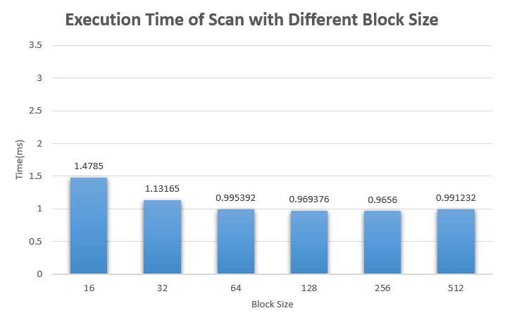
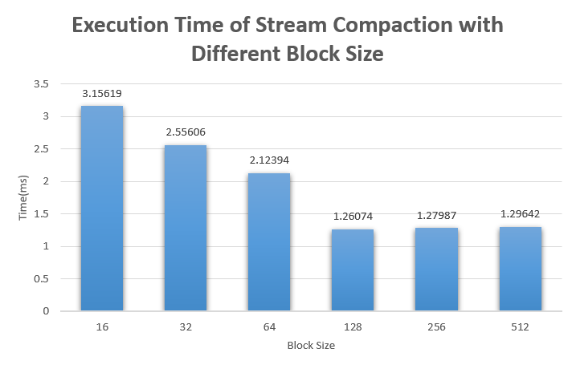
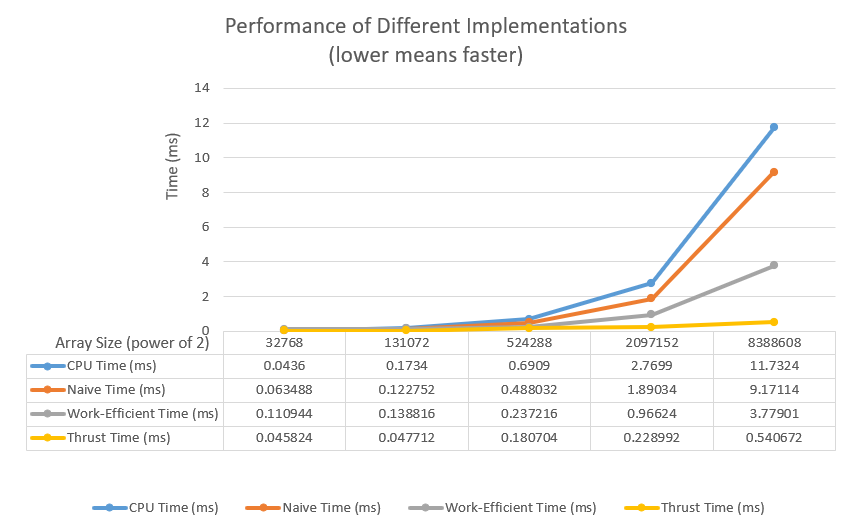
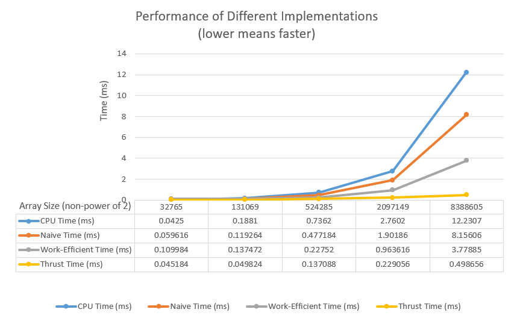
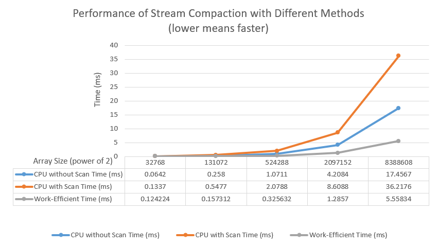

CUDA Stream Compaction
======================

**University of Pennsylvania, CIS 565: GPU Programming and Architecture, Project 2**

* Zhuohao Lin
  * [LinkedIn](https://www.linkedin.com/in/zhuohao-lin-960b54194/)
* Tested on: Windows 10, i7-10875H @ 2.30GHz 16GB, NVIDIA Grforce RTX 2060 6GB (personal machine)

# Overview
In this project, I implemented some widely used parallel algorithms such as work-efficient scan and stream compaction. I also implemented naive scan,CPU scan and CPU stream compaction for performance comparison.

## Features
* CPU scan, CPU stream compaction with scan and without scan (for output and performance comparison)
* Naive scan in GPU: A simple algorithm for scan.
* Work-efficent scan in GPU: A more efficient algorithm for scan. I also made some optimization to reduce the threads usage in GPU.
* Stream Compaction in GPU: A algorithm to shrink the size of the data and keep useful data in order.

# Output
The Output below is run with array size 2<sup>23</sup> (power-of-two arrays) and 2<sup>23</sup> - 3 (non-power-of-two arrays)
```
****************
** SCAN TESTS **
****************
    [  29  36  26  20  22  24  38  19  43  11  26  31  36 ...  43   0 ]
==== cpu scan, power-of-two ====
   elapsed time: 11.7361ms    (std::chrono Measured)
    [   0  29  65  91 111 133 157 195 214 257 268 294 325 ... 205475551 205475594 ]
==== cpu scan, non-power-of-two ====
   elapsed time: 11.6701ms    (std::chrono Measured)
    [   0  29  65  91 111 133 157 195 214 257 268 294 325 ... 205475522 205475524 ]
    passed
==== naive scan, power-of-two ====
   elapsed time: 8.80413ms    (CUDA Measured)
    passed
==== naive scan, non-power-of-two ====
   elapsed time: 8.74237ms    (CUDA Measured)
    passed
==== work-efficient scan, power-of-two ====
   elapsed time: 4.87853ms    (CUDA Measured)
    passed
==== work-efficient scan, non-power-of-two ====
   elapsed time: 3.78675ms    (CUDA Measured)
    passed
==== thrust scan, power-of-two ====
   elapsed time: 0.464672ms    (CUDA Measured)
    passed
==== thrust scan, non-power-of-two ====
   elapsed time: 0.476544ms    (CUDA Measured)
    passed

*****************************
** STREAM COMPACTION TESTS **
*****************************
    [   3   0   2   2   0   0   0   3   3   1   2   1   0 ...   3   0 ]
==== cpu compact without scan, power-of-two ====
   elapsed time: 18.0229ms    (std::chrono Measured)
    [   3   2   2   3   3   1   2   1   3   2   1   1   2 ...   1   3 ]
    passed
==== cpu compact without scan, non-power-of-two ====
   elapsed time: 17.9753ms    (std::chrono Measured)
    [   3   2   2   3   3   1   2   1   3   2   1   1   2 ...   2   1 ]
    passed
==== cpu compact with scan ====
   elapsed time: 39.9532ms    (std::chrono Measured)
    [   3   2   2   3   3   1   2   1   3   2   1   1   2 ...   1   3 ]
    passed
==== work-efficient compact, power-of-two ====
   elapsed time: 5.8511ms    (CUDA Measured)
    passed
==== work-efficient compact, non-power-of-two ====
   elapsed time: 5.53261ms    (CUDA Measured)
    passed
```

# Performance Analysis

## Optimal Block Size

In order to find the optimal block size, I use the optimized work-efficient algorithm. I tested with different block sizes and measured the excution time. Shorter execution time means better performance.




According to the 2 graphs above, we can see that the performance improves as the block size increases. After reaching block size 128, increasing block size doesn't improve the performance anymore for either scan or stream compaction. Therefore, 128 is the optimal block size for both scan and stream compaction.

## Performance of Different Scan Algorithms



The two graphs above shows the performance of different implementations with different array sizes. With small array size, CPU scan has better performance. As array size becomes larger enough, all GPU scan methods outweigh CPU scan.

Among GPU methods, Thrust implementation always has the best performance. Work-efficient method has poorer performance than naive on small arrays but significant better performance on large arrays.

<br/>
It's worth mentioning that the work-efficient scan algorithm is optimized on threads usage. Before optimization, the work-efficient scan has even worse performance than naive scan. This is because I used % (module operator) which is slow on GPU. Moreover, before optimization, most of threads are simply waiting for few threads to finish computation. By calculating the index of data which needs to be changed within every thread, I can free up most threads to make the scan more efficient.

<br/>

## Performance of Different Stream Compaction Algorithms

From the graph, it's obvious that stream compaction on GPU using work-efficient scan has much better performance on large arrays than CPU approches. This is expected since stream compaction on GPU saves a lot of time with work-efficient scan.


