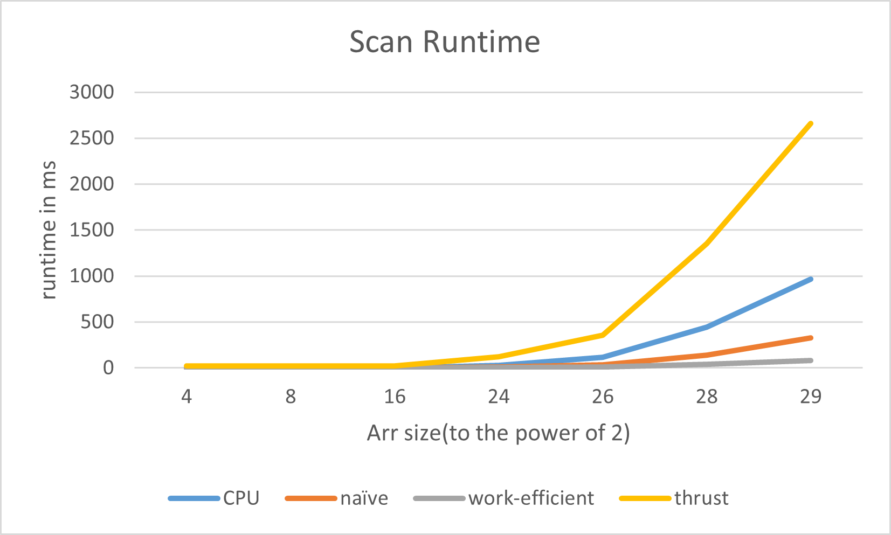

CUDA Stream Compaction
======================

**University of Pennsylvania, CIS 565: GPU Programming and Architecture, Project 2**

* XiaoyuDu
* Tested on: Windows 10, i9-11900KF @ 3.50GHz, RTX 3080 (Personal PC)
  
### Description  
This project tested for different method of scan and compact.
  
### Feature  
I implemented all the features for part 1 - 5.
* CPU Scan & Stream Compaction
* Naive GPU Scan Algorithm
* Work-Efficient GPU Scan & Stream Compaction
* Thrust's Implementation
* GPU Work-Efficient Method Optimization
  
### Performance Analysis  
My optimized number of blocks is 128.  
I campared different method with different size array, and the result plot is shown below. I am a bit confused why my Thrust implementation takes so long to run. I think my implementation should be correct.  
  

Below is the test result with 2^20 size array.  
```
****************
** SCAN TESTS **
****************
    [  28   9  12  41  33  49  46   3  11  27  35   5  47 ...   8   0 ]
==== cpu scan, power-of-two ====
   elapsed time: 1.7669ms    (std::chrono Measured)
    [   0  28  37  49  90 123 172 218 221 232 259 294 299 ... 25674595 25674603 ]
==== cpu scan, non-power-of-two ====
   elapsed time: 1.7544ms    (std::chrono Measured)
    [   0  28  37  49  90 123 172 218 221 232 259 294 299 ... 25674502 25674539 ]
    passed
==== naive scan, power-of-two ====
   elapsed time: 0.510176ms    (CUDA Measured)
    passed
==== naive scan, non-power-of-two ====
   elapsed time: 0.695424ms    (CUDA Measured)
    passed
==== work-efficient scan, power-of-two ====
   elapsed time: 0.43328ms    (CUDA Measured)
    passed
==== work-efficient scan, non-power-of-two ====
   elapsed time: 0.631104ms    (CUDA Measured)
    passed
==== thrust scan, power-of-two ====
   elapsed time: 28.3783ms    (CUDA Measured)
    passed
==== thrust scan, non-power-of-two ====
   elapsed time: 7.89008ms    (CUDA Measured)
    passed

*****************************
** STREAM COMPACTION TESTS **
*****************************
    [   1   2   1   1   1   2   0   2   2   3   0   3   3 ...   3   0 ]
==== cpu compact without scan, power-of-two ====
   elapsed time: 3.7818ms    (std::chrono Measured)
    [   1   2   1   1   1   2   2   2   3   3   3   2   3 ...   3   3 ]
    passed
==== cpu compact without scan, non-power-of-two ====
   elapsed time: 3.5542ms    (std::chrono Measured)
    [   1   2   1   1   1   2   2   2   3   3   3   2   3 ...   3   3 ]
    passed
==== cpu compact with scan ====
   elapsed time: 9.8808ms    (std::chrono Measured)
    [   1   2   1   1   1   2   2   2   3   3   3   2   3 ...   3   3 ]
    passed
==== work-efficient compact, power-of-two ====
   elapsed time: 1.07133ms    (CUDA Measured)
    passed
==== work-efficient compact, non-power-of-two ====
   elapsed time: 0.849984ms    (CUDA Measured)
    passed
```