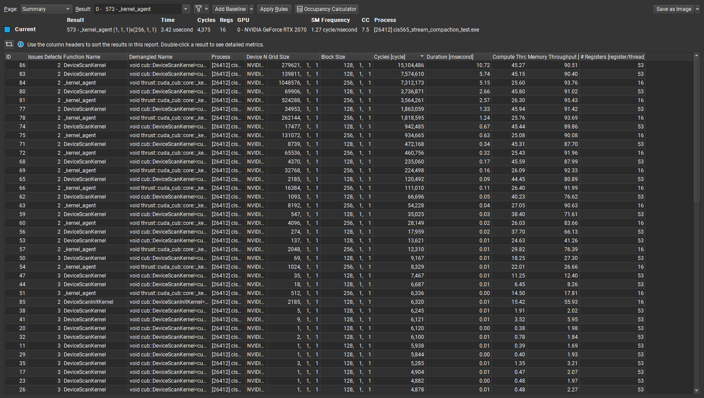

## <div align="center"> University of Pennsylvania, CIS 565: GPU Programming and Architecture </div>
# <div align="center"> CUDA Stream Compaction </div>
- Name: Tongwei Dai
	- [LinkedIn Page](https://www.linkedin.com/in/tongwei-dai-583350177/)
- Tested on: Windows 10, i7-8700 @ 3.20 GHz 16GB, RTX 2070


## Features Implemented
1. CPU reduction, scan, and stream compaction
2. Naive GPU scan
3. Efficient GPU scan (upsweep and downsweep)
4. Work-Efficient GPU scan using shared memory, with support for arbitrary array sizes (toggle using the macro `SHARED_OPT` in `efficient.cu`)
5. GPU compaction using GPU scan
6. GPU radix sort (`rsort.h` and `rsort.cu`)
7. scan, stream compaction, and sort using the Thrust library

## Default Program Output Example
- NOTE: I added some extra testcases for thrust-based implementations and radix sort
```
****************
** SCAN TESTS **
****************
    [  29  49  28   2  12  12  20   7  49  16  26  47  44 ...   7   0 ]
==== cpu scan, power-of-two ====
   elapsed time: 183.76ms    (std::chrono Measured)
    [   0  29  78 106 108 120 132 152 159 208 224 250 297 ... -1007914493 -1007914486 ]
==== cpu scan, non-power-of-two ====
   elapsed time: 182.261ms    (std::chrono Measured)
    [   0  29  78 106 108 120 132 152 159 208 224 250 297 ... -1007914579 -1007914556 ]
    passed
==== naive scan, power-of-two ====
   elapsed time: 221.645ms    (CUDA Measured)
    passed
==== naive scan, non-power-of-two ====
   elapsed time: 178.254ms    (CUDA Measured)
    passed
==== work-efficient scan, power-of-two ====
   elapsed time: 36.8746ms    (CUDA Measured)
    passed
==== work-efficient scan, non-power-of-two ====
   elapsed time: 35.2413ms    (CUDA Measured)
    passed
==== thrust scan, power-of-two ====
   elapsed time: 2.95542ms    (CUDA Measured)
    passed
==== thrust scan, non-power-of-two ====
   elapsed time: 2.99418ms    (CUDA Measured)
    passed

*****************************
** STREAM COMPACTION TESTS **
*****************************
    [   3   0   3   0   1   2   0   1   1   2   0   3   0 ...   3   0 ]
==== cpu compact without scan, power-of-two ====
   elapsed time: 277.957ms    (std::chrono Measured)
    [   3   3   1   2   1   1   2   3   2   2   1   1   2 ...   3   3 ]
    passed
==== cpu compact without scan, non-power-of-two ====
   elapsed time: 278.51ms    (std::chrono Measured)
    [   3   3   1   2   1   1   2   3   2   2   1   1   2 ...   1   1 ]
    passed
==== cpu compact with scan ====
   elapsed time: 580.714ms    (std::chrono Measured)
    [   3   3   1   2   1   1   2   3   2   2   1   1   2 ...   3   3 ]
    passed
==== work-efficient compact, power-of-two ====
   elapsed time: 54.4974ms    (CUDA Measured)
    passed
==== work-efficient compact, non-power-of-two ====
   elapsed time: 54.3083ms    (CUDA Measured)
    passed
==== thrust compact, power-of-two ====
   elapsed time: 2.92499ms    (CUDA Measured)
    passed
==== thrust compact, non-power-of-two ====
   elapsed time: 2.93741ms    (CUDA Measured)
    passed
```

## GPU Radix Sort
- usage
``` cpp
int in[10], out[10];
for(int i=0; i<10; ++i)
  in[i] = rand() % 256;
StreamCompaction::RadixSort::sort(10, out, in);
for(int i=0; i<10; ++i)
  std::cout << out[i] << "\n,"[i<9];
```
- sample test output
```
==== gpu sort, power-of-two, small ====
   elapsed time: 0.462848ms    (std::chrono Measured)
    [   0   1   2   3   4   5   6   7 ]
    passed
==== gpu sort, non-power-of-two, small ====
    [   4   7   2   6   3   5   1   0  11 ]
   elapsed time: 0.37232ms    (std::chrono Measured)
    [   0   1   2   3   4   5   6   7  11 ]
    passed
==== gpu sort, power-of-two, large ====
   elapsed time: 149.463ms    (std::chrono Measured)
    passed
```

## Choosing the Optimal Block Size
- 64 is chosen as the block size for performance comparison
- Since the work-efficient implementation uses shared memory + divide and conquer, small block sizes may introduce a significant overhead of spliting and merging.
- I tried a lot of block sizes and observed that performance tends to be more or less similar for anything greater than 64.

|Block Size| Runtime (Work-Efficient) with around 10M elements |
|-|-|
|2 |33.7115s|
|4|11.3347s|
|8|11.8743s|
|16|7.36387s|
|32|7.92694s|
|64|5.5519s|
|128|6.11123s|
|256|6.63472s|
|512|6.36026s|

## Performance Analysis of the Scan function

- the above graph shows how the 4 implementations of Scan (CPU, Naive, Work-Efficient, and Thrust) scale with very large array sizes up to 2<sup>28</sup> number of elements
- GPU Naive has roughly the same performance as the CPU implementation; this can be caused by several reasons:
  1. my implementation of naive uses global memory only (which is slow)
  2. warp partitioning is not optimal, which causes divergence in most warps
  3. there is an expensive modular operation in every thread
- GPU Work-Efficient is a lot more performant than the CPU and the naive implementations by employing several optimizations (i.e., shared memory, warp partitioning, bank conflict avoidance). However, I can still find a lot of room of improvement in my implementation:
  1. there is a memcpy in each recursive call that converts inclusive scan to exclusive scan (which may not be necessary?)
  2. there are multiple kernel passes during the divide-and-conquer steps to offset the sums, which may be further optimized. 
- Thrust implementation is the most efficient out of all implementations.

- upon analyzing the profiling data of the thrust scan, I see that it seems to launch kernels with different block sizes. There appears to be no copy whatsoever between iterations. Maybe the thrust implementation adjusts blocksizes during the resursive split? Or maybe it interleaves inclusive and exclusive scans so that no copy/ conversion is necessary.

## Why is My GPU Approach So Slow?
- my work-efficient implementations greatly outperform the CPU after around 1024 elements.
- with small test cases (under 256 elements), the problem with GPU implementations is that it has the overhead of memory transfer, kernel launch, split & merge, etc, so it generally just cannot do better than CPU. Even the thrust implementation is slower than the CPU with small test cases.