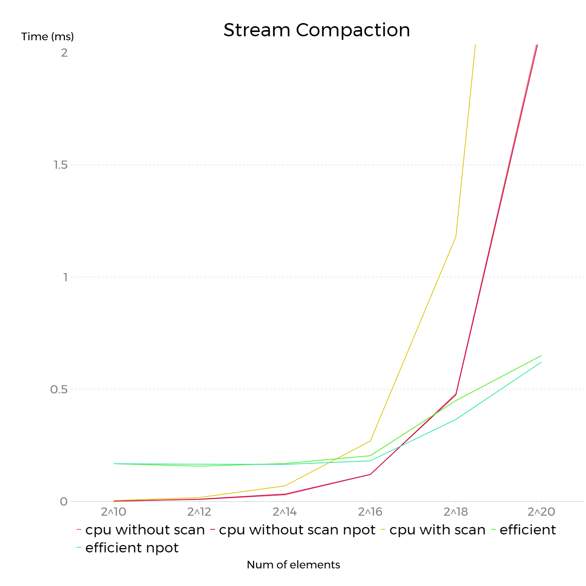

CUDA Stream Compaction
======================

**University of Pennsylvania, CIS 565: GPU Programming and Architecture, Project 2**

Jiajun Li

Linkedin: [link](https://www.linkedin.com/in/jiajun-li-5063a4217/)

Tested on: Windows 10, i7-12700 @ 2.10GHz, 32GB, RTX3080 12GB

CUDA Compute Capability: 8.6

## **Overview**

In this project, different scan methods and some of scan applications are implemented:

CPU side:
  1. CPU navie scan
  2. CPU compaction using CPU navie scan
  3. CPU navie radix sort using CPU navie scan

GPU side:
  1. GPU navie scan
  2. GPU efficient scan with threads reduction
  3. GPU efficient stream compaction using GPU efficient scan

Full explanations of each method can be found in [GPU Gem 3 Ch 39](https://developer.nvidia.com/gpugems/gpugems3/part-vi-gpu-computing/chapter-39-parallel-prefix-sum-scan-cuda).

The project also includes thrust::scan as a benchmark in performance analysis.

## **Project Setup**

This project included the following changes from the original project:

1. Add ```radix_sort.h``` and ```radix_sort.cu``` to ```stream_compaction/CMakeLists```

2. Add radix sort test code in ```src\main.cpp```

## **Output example**

```
****************
** SCAN TESTS **
****************
    [  45  11  41  13  34  22   1  22   6   5   3   5  21 ...   9   0 ]
==== cpu scan, power-of-two ====
  elapsed time: 0.0519ms    (std::chrono Measured)
    [   0  45  56  97 110 144 166 167 189 195 200 203 208 ... 801487 801496 ]
==== cpu scan, non-power-of-two ====
  elapsed time: 0.0519ms    (std::chrono Measured)
    [   0  45  56  97 110 144 166 167 189 195 200 203 208 ... 801379 801414 ]
    passed
==== naive scan, power-of-two ====
  elapsed time: 0.453632ms    (CUDA Measured)
    passed
==== naive scan, non-power-of-two ====
  elapsed time: 0.403456ms    (CUDA Measured)
    passed
==== naive scan with shared memory, power-of-two ====
n > 1024, navie scan with shared memory failed.
  elapsed time: 0.002048ms    (CUDA Measured)
    a[1] = 45, b[1] = 0
    FAIL VALUE
==== naive scan with shared memory, non-power-of-two ====
n > 1024, navie scan with shared memory failed.
  elapsed time: 0.002048ms    (CUDA Measured)
    a[1] = 45, b[1] = 0
    FAIL VALUE
==== work-efficient scan, power-of-two ====
  elapsed time: 0.31744ms    (CUDA Measured)
    passed
==== work-efficient scan, non-power-of-two ====
  elapsed time: 0.08192ms    (CUDA Measured)
    passed
==== thrust scan, power-of-two ====
  elapsed time: 0.044032ms    (CUDA Measured)
    passed
==== thrust scan, non-power-of-two ====
  elapsed time: 0.045056ms    (CUDA Measured)
    passed

*****************************
** STREAM COMPACTION TESTS **
*****************************
    [   1   0   3   0   3   0   2   3   1   3   3   1   1 ...   0   0 ]
==== cpu compact without scan, power-of-two ====
  elapsed time: 0.0657ms    (std::chrono Measured)
    [   1   3   3   2   3   1   3   3   1   1   2   3   1 ...   3   1 ]
    passed
==== cpu compact without scan, non-power-of-two ====
  elapsed time: 0.0648ms    (std::chrono Measured)
    [   1   3   3   2   3   1   3   3   1   1   2   3   1 ...   3   3 ]
    passed
==== cpu compact with scan ====
  elapsed time: 0.1507ms    (std::chrono Measured)
    [   1   3   3   2   3   1   3   3   1   1   2   3   1 ...   3   1 ]
    passed
==== work-efficient compact, power-of-two ====
  elapsed time: 0.17408ms    (CUDA Measured)
    passed
==== work-efficient compact, non-power-of-two ====
  elapsed time: 0.171008ms    (CUDA Measured)
    passed

*****************************
** RADIX SORT TESTS **
*****************************
==== cpu radix sort, power-of-two ====
  elapsed time: 0.4766ms    (std::chrono Measured)
    [   0   0   0   0   0   0   0   0   0   0   0   0   0 ...  49  49 ]
==== cpu radix sort, non-power-of-two ====
  elapsed time: 0.4721ms    (std::chrono Measured)
    [   0   0   0   0   0   0   0   0   0   0   0   0   0 ...  49  49 ]
```


## **Performance Analysis**

In all the following analysis, less time is better.

### **Scan**


* Work efficient scan out performs cpu scan when number of elements is greater than 2^16.

* Work efficient scan roughly align with thrust scan when number of elements is greater than 2^18.

* Navie GPU scan is always slower than navie CPU scan. This is because GPU method accesses data trhough global memory, which is considerably costy.


### **Stream Compaction**



* Using scan will make it slower in the CPU implementation because scan introduces more iterations over array.

* Work efficient scan starts to out perform cpu scan when number of elements is greater than 2^18.

* For work efficient scan, it performs slightly better when the number of elements is not power of two.

### **Radix Sort**


### **Future Improvement**

1. Implement parallel radix sort and compare it with navie radix sort.

2. Make GPU scans even more efficient by using share memory.


