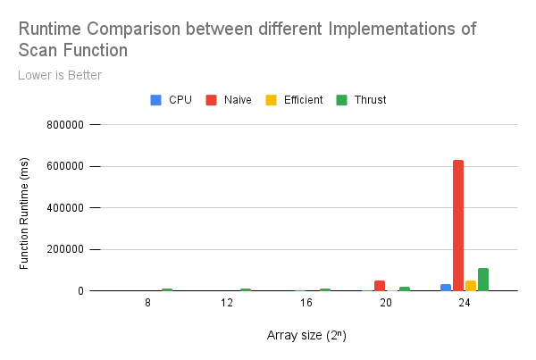
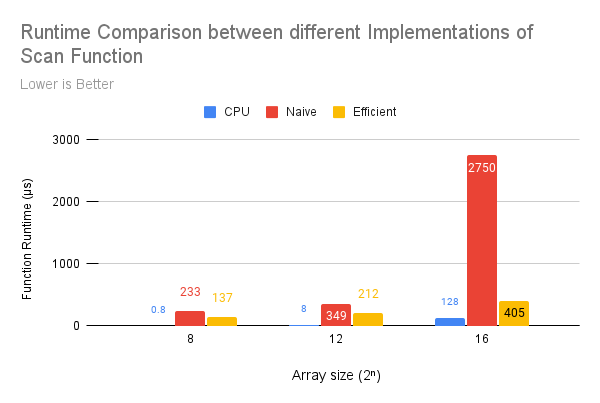
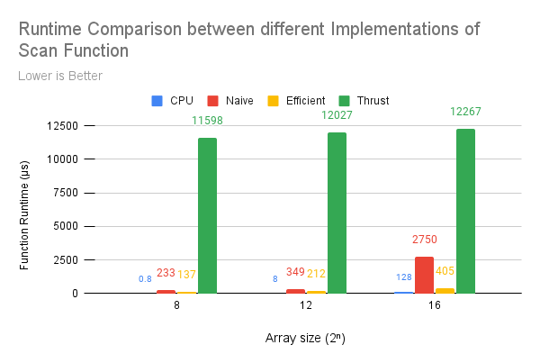
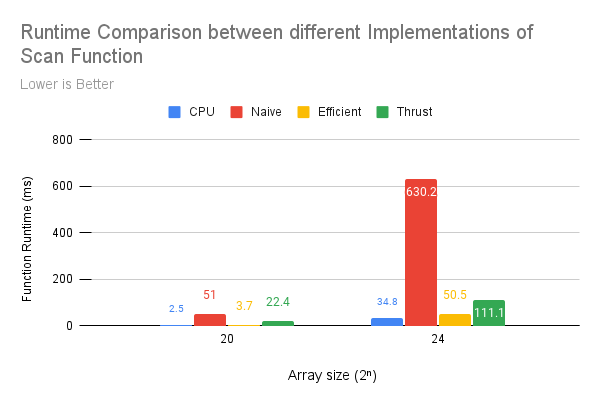

CUDA Stream Compaction
======================

**University of Pennsylvania, CIS 565: GPU Programming and Architecture, Project 2**

* David Li
* [LinkedIn](https://www.linkedin.com/in/david-li-15b83817b/)
* Tested on: Windows 10, Intel(R) Core(TM) i9-10980HK CPU @ 2.40GHz 32Gb, GTX 2070 Super (Personal Computer)

[Repo Link](https://github.com/theCollegeBoardOfc/Project2-Stream-Compaction)

This project consists of several implementations of the scan and stream compact functions. The scan implementations include a cpu approach, a naive gpu approach, a work efficient gpu approach and an implementation using the thrust library. The stream compaction functions include a cpu approach without scan, a cpu appraoch with scan, and a gpu approach. Though one would expect the gpu to perform better than the cpu, in this case, without optimization the gpu, even with a work efficient algorithm is still slower than the cpu.

The following is a graph comparing the runtimes of the different implementations of scan with increasing array size. The x-axis is exponential: so data at x == 12 indicates an array size of 2 to the power of 12. The y-axis is in microseconds.

This data probably doesn't really make a lot of things clear, so I have split up the data into some more charts for clarity. I do think though, that it's valuable to present a wholistic view of all the data I collected. Even if presenting it all together lacks some clarity.

The following graph only compares the cpu implementation with the naive and work efficient approaches. The array sizes being used are all rather small, with 256 elmenets on the low end to around 65 thousand elements on the high end. 

Here the cpu outperforms the gpu in all cases. Comparing the cpu with the work efficient approach. The gap between them shortens with increasing array size. At the smaller end, the cpu runs over 100 times faster than the gpu, but on the high end it's running less than four times faster. This is expected, as the overhead of using the gpu outweighs the benefits of the parallel computation it provides. Interestingly, the naive approach begins performing even worse relatively. 

Now, the thrust implementation is reintroduced to the chart. The chart follows the same scale as the one directly before it.

The thrust implementation performs quite poorly across the board. Upon inspecting it in NSight, a lot of cuda copy calls could be seen. Perhaps, thrust makes a lot of memory copies. However, it is highly unlikely that is the full story.

The final graph shows some data of very large array sizes with element counts nearing 17 million. All four implementations of scan are shown. The y-axis scale has been changed to milliseconds for clarity sake.

Despite the expectation that the gpu should begin performing better than the cpu this is not the case. Simply comparing the work efficient approach with the cpu, it's likely a lot of unnecessary overhead is being created. The number of threads generated each time in the kernel is relative to the size of the input array at every step, rather than the number of threads actually needed. For example if the array has a million elements, the kernel will genereate a million threads even if it only needs two. However, the naive approach performing this poorly is genuinely mistifying. At worst it seems to do about double the work as the efficient approach, yet it takes 10 times longer.

