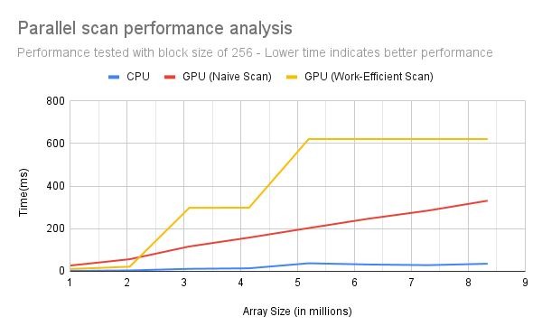
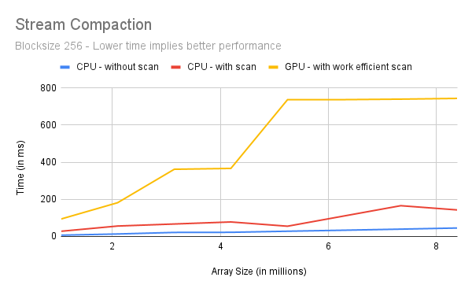

CUDA Stream Compaction
======================

**University of Pennsylvania, CIS 565: GPU Programming and Architecture, Project 2**

* RHUTA JOSHI
  * [LinkedIn](https://www.linkedin.com/in/rcj9719/)
  * [Website](https://sites.google.com/view/rhuta-joshi)

* Tested on: Windows 10 Home, i5-7200U CPU @ 2.50GHz, NVIDIA GTX 940MX 4096 MB (Personal Laptop), RTX not supported
* GPU Compatibility: 5.0

Introduction
---

### Stream Compaction

Stream compaction is an important parallel computing primitive that generates a compact output buffer with selected elements of an input buffer based on some condition. Basically, given an array of elements, we want to create a new array with elements that meet a certain criteria while preserving order.
The important steps in a parallel stream compaction algorithm are as follows:


1. Step 1: Mapping - Compute a temporary array containing
    - 1 if corresponding element meets criteria
    - 0 if element does not meet criteria
2. Step 2: Scanning - We can use one of the scanning techniques expanded below to run an exclusive scan on the mapped temporary array
    - Naive scan
    - Work-efficient scan
3. Step 3: Scattering - Insert input data at index obtained from scanned buffer if criteria is set to true
    - Result of scan is index into final array
    - Only write an element if temporary array has a 1

For this project the criteria into consideration is the number should not be equal to 0.

### Parallel Scanning

In this project, I implemented stream compaction on CPU and GPU using parallel all-prefix-sum (commonly known as scan) with CUDA and analyzed the performance of each of them. The sequential scan algorithm is poorly suited to GPUs because it does not take advantage of the GPU's data parallelism. The parallel version of scan that utilizes the parallel processors of a GPU to speed up its computation. The parallel scan can be performed in two ways:

1. Naive scan - This is an O(nlogn) algorithm which iteratively adds elements with an offset.
2. Work-efficient scan - This is an O(n) algorithm
    - Step 1: **Upsweep scan** (Parallel Reduction phase) - In this, we traverse the tree from leaves to root computing partial sums at internal nodes of the tree. At the end of this phase, the root node (the last node in the array) holds the sum of all nodes in the array.

        

    - Step 2: **Downsweep scan** (Collecting scanned results) - In the down-sweep phase, we traverse back down the tree from the root, using the partial sums from the reduce phase to build the scan in place on the array. We start with adding the identity value at the end of upsweep output array. At each level,
        - Left child: Copy the parent value
        - Right child: Add the parent value and left child value copying  root value.

        


Tests performed
---
The following tests are run with blocksize of 256 for an array size of 2<sup>23</sup> which is around 8 million array elements.
```
****************
** SCAN TESTS **
****************
    [   3  16  30  16   9   8   8  11  41  20  38  34   7 ...   4   0 ]
==== cpu scan, power-of-two ====
   elapsed time: 0ms    (std::chrono Measured)
    [   0   3  19  49  65  74  82  90 101 142 162 200 234 ... 205461733 205461737 ]
==== cpu scan, non-power-of-two ====
   elapsed time: 0ms    (std::chrono Measured)
    passed
==== naive scan, power-of-two ====
   elapsed time: 327.662ms    (CUDA Measured)
    passed
==== naive scan, non-power-of-two ====
   elapsed time: 328.087ms    (CUDA Measured)
    passed
==== work-efficient scan, power-of-two ====
   elapsed time: 0ms    (CUDA Measured)
    passed
==== work-efficient scan, non-power-of-two ====
   elapsed time: 0ms    (CUDA Measured)
    passed

*****************************
** STREAM COMPACTION TESTS **
*****************************
    [   3   3   1   0   3   3   3   3   3   0   0   1   0 ...   3   0 ]
==== cpu compact without scan, power-of-two ====
   elapsed time: 45.6113ms    (std::chrono Measured)
    passed
==== cpu compact without scan, non-power-of-two ====
   elapsed time: 46.366ms    (std::chrono Measured)
    passed
==== cpu compact with scan ====
   elapsed time: 142.93ms    (std::chrono Measured)
    passed
==== work-efficient compact, power-of-two ====
   elapsed time: 743.851ms    (CUDA Measured)
    passed
==== work-efficient compact, non-power-of-two ====
   elapsed time: 739.94ms    (CUDA Measured)
    passed
Press any key to continue . . .
```

Performance Analysis
---
### Scan algorithm

For different block sizes ranging from 4 to 1024, the most optimized performance was observed with a block size of 128 or 256. The performance below block size of 32 is really poor because warp size is 32 and block sizes lower than that can force it to perform operations serially. As the block size increases more than 256, the number of idle threads per iteration also increases hence decreasing performance. The following chart shows test results with block size of 256.



Based on this image, we can clearly see that the CPU is taking lesser time than the GPU parallel algorithms. This can be because of the following reasons:
1. In the current implementation, number of threads hosted in each iteration of upsweep and downsweep is the same. We know that in each iteration, many threads are idle and are simply returning without performing any meaningful operation.
2. Even if some threads in a warp are done with execution with an early exit, they have to wait for other threads in the warp. When this happens due to conditional stalls, it is called warp divergence. This can be avoided by warp partitioning, such that threads which are likely to terminate together are grouped together in a single warp.

### Stream compaction

Stream compaction shows a similar trend when compared to scanning. The following graph does not cover stream compaction tests using naive scan method. The behavior with respect to block size is also similar as observed in scanning, described above. 


References
---
1. GPU Parallel Algorithms Course Presentation - CIS 5650 - Fall 2022
2. GPU Gems 3, Chapter 39 - [Parallel Prefix Sum (Scan) with CUDA](https://developer.nvidia.com/gpugems/GPUGems3/gpugems3_ch39.html)
