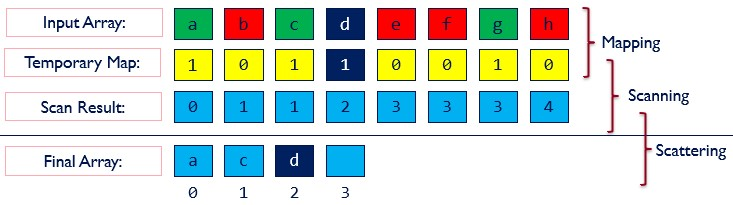
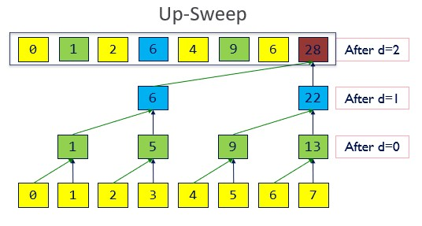
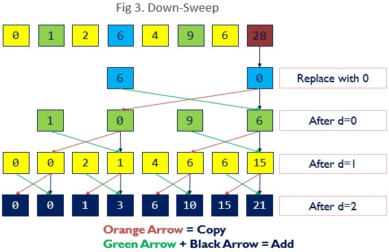
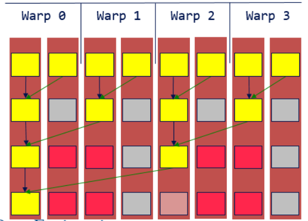
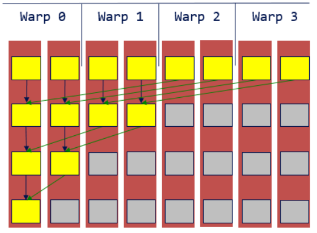

CUDA Stream Compaction
======================

**University of Pennsylvania, CIS 565: GPU Programming and Architecture, Project 2**

* Megan Reddy
  * [LinkedIn](https://www.linkedin.com/in/meganr25a949125/), [personal website](https://meganr28.github.io/)
* Tested on: Windows 10, AMD Ryzen 9 5900HS with Radeon Graphics @ 3301 MHz 16GB, NVIDIA GeForce RTX 3060 Laptop GPU 6GB (Personal Computer)
* Compute Capability: 8.6

### Overview

**Stream compaction** is a common algorithm used in path tracing, collision detection, sparse matrix multiplication, and many other applications. 
The idea is to produce a new array with elements that meet a certain criteria, while preserving the order of the original array. Elements that do not meet the criteria are "discarded" and do not make
it into the final array. An illustration of this process provided below:

<p align="center">
  
</p>
<p align="center"><em>Image Credit: NVIDIA</em></p>

#### Prefix-Sum

The <em>all-prefix-sums</em> or **scan** operation on an array is the consecutive sum of the first [0, 1, ..., n] elements of the array.

```
a0 = I
a1 = a0
a2 = a0 + a1
...

Input array:  3 1 7  0  4  1  6  3
Output array: 0 3 4 11 11 15 16 22
```
There are two types of scan operations - the **exclusive scan** and the **inclusive scan**.

##### Exclusive Scan

In an exclusive scan, the element <em>j</em> of the result does not include element <em>j</em> of the input.
 
```
3 1 7  0  4  1  6  3
0 3 4 11 11 15 16 22
```

For this assignment, the term "scan" will refer to an exclusive scan. 

##### Inclusive Scan

In an inclusive scan, the element <em>j</em> of the result includes element <em>j</em> of the input.

```
3 1  7  0  4  1  6  3
3 4 11 11 15 16 22 25
```

#### Applications to Stream Compaction

In stream compaction, there are three main steps:

1. Computing a temporary array of 1s/0s signifying elements that meet the criteria
2. Running an exclusive scan on the temporary array (indices of elements in output array)
3. Write elements that meet the criteria to the output array (scattering) 

#### CPU vs. GPU Scan Implementations

##### CPU - Serial Version

The serial version of **scan** consists of a for loop that examines each pair of elements at the previous index and sums them.
CPU stream compaction passes over the input array once to create a temporary array of booleans. It then scans the boolean array 
to compute an array of indices to correctly place the valid elements in the output array. The final pass checks to see if an element
has passed using the boolean array, and if it has, retrieves its index from the scan array. It write the original input value to this index
in the output array. The total runtime in O(n).

##### GPU - Parallel Version

There are two ways to implement the parallel version of the scan algorithm. One is the **naive** method, which launches <em>n</em> threads 
to compute partial sums. A visualization is below (image credit: [NVIDIA](https://developer.nvidia.com/gpugems/gpugems3/part-vi-gpu-computing/chapter-39-parallel-prefix-sum-scan-cuda)):


```
for d = 1 to log2 n:
    for all k in parallel:
        if k >= 2^(d-1)  then
            out[k] += in[k – 2^(d-1)] + in[k]
        else
            out[k] = in[k]
```

However, this algorithm is not very efficient. It performs a total of O(nlog2n) adds, whereas the CPU implementation performs O(n) adds.
We can improve this by using the **work-efficient** scan algorithm. This algorithm removes the extra log2n work by building a balanced binary tree
from the input data and sweeping this tree up and down to compute the prefix sum (image credit: [NVIDIA](https://developer.nvidia.com/gpugems/gpugems3/part-vi-gpu-computing/chapter-39-parallel-prefix-sum-scan-cuda)).

 \
*An illustration of the upsweep (reduction) portion of the algorithm.*

 \
*An illustration of the downsweep portion of the algorithm.*

```
// Upsweep
for d = 0 to log2 n - 1:
      for all k = 0 to n – 1 by 2^(d+1) in parallel:
           out[k +  2^(d+1) – 1] += out[k +  2^(d)  – 1]

// Downsweep
out[n – 1] = 0
for d = log2 n – 1 down to 0 do
       for all k = 0 to n – 1 by 2 d +1 in parallel do
            t = x[k +  2 d  – 1]
            x[k +  2 d  – 1] = x[k +  2 d +1 – 1]
            x[k +  2 d +1 – 1] = t +  x[k +  2 d +1 – 1]
```

A third way of implementing scan on the GPU is using the **Thrust** library. 
Thrust comes with a build-in function called ```exclusive_scan()``` that can be called on device vectors.
An example invocation would be ```thrust::exclusive_scan(dev_in.begin(), dev_in.end(), dev_out.begin())```. 

### Extra Credit Features

#### Why is My GPU Approach So Slow?

In the diagrams below, we can see that the original work-efficient scan algorithm causes warp divergence. Not all threads
in the warp are active, yet the warp cannot be retired since other threads are performing work. In the original upsweep/downsweep procedures,
we half/double the number of threads doing work each time. These threads are not at consecutive indices, leaving other threads in the warp idle.
In the optimized version, we instead make threads at consecutive indices do the work so that we can retire unused warps early and limit divergence. 

| 4 divergent warps             |  1 divergent warp |
:-------------------------:|:-------------------------:
  |  

In code, this is a simple change to the way we index. For example, in the upsweep kernel, we check to see that `thread_id < stride` and if so, we make that 
thread do work. We do have to recalculate the index offsets to make the threads write to the correct places. The same positions are written to, but now different thread numbers do
the work.

```
if (index < stride) {
    out[offset_d * (2 * index + 2) - 1] += out[offset_d * (2 * index + 1) - 1];
}

// NOTE: offset_d = 2^d
```

The downsweep kernel is also upgraded to examine consecutive thread indices and can be seen in `efficient.cu`. A performance comparison between the optimized and unoptimized versions
can be found in the **Performance Analysis** section below. 

### Performance Analysis

All performance data was recorded in **Release Mode** in **Visual Studio 2019**. Additionally, the results for non-power-of-two 
arrays are plotted since power-of-two arrays may not be encountered as often.

Before comparing each implementation, it was necessary to find the optimal block size for each GPU algorithm.
An array size of **2<sup>25</sup> (33,554,432) elements** was used for these tests. A comparison of the runtime is
shown below.

#### Runtime vs. Block Size (Scan)


#### Runtime vs. Block Size (Compaction)


The optimal block size was 128, 256, and 512 for the naive, uoptimized work-efficient, and optimized work-efficient implementations, respectively. 
It is worth noting that there is not much performance gain from increasing block size past 256 for both 
implementations. In fact, it seems to slow down the implementations a bit (notice how the curves on both 
the scan and compaction graphs slope upwards after 256). This is most likely because with larger block sizes,
there are potentially many unused threads or lower occupancy. Since a GPU's goal is to hide latency and memory 
accesses, it needs to choose a block size that will allow it to have more active blocks running at once.

Now that the optimal block size is chosen for both implementations, we can compare how both the CPU and GPU algorithms
perform on arrays of different sizes. In order to determine the runtimes, a timer was started after initial memory 
allocation and ended before deallocation.

#### Runtime vs. Array Size (Scan)


The Thrust implementation performed the fastest out of all the implementations. Since this is a well-established and tested library,
there are likely several optimizations that make it perform better than the other implementations. When examining the timeline graph 
using Nsight Systems 2022.3.4, we can see that Thrust uses `cudaMemcpyAsync` as well as `cudaStreamSynchronize` instead of `cudaDeviceSynchronize`.


The CPU implementation performed faster than the naive and work-efficient implementations for smaller array sizes (< 15 million elements). Since memory overhead
was not factored into timing, one possible cause of this is that for small array sizes, the extra overhead of launching kernels made GPU implementations slower.
Additionally, warp divergence and high numbers of idle threads could have made the GPU implementations less efficient.
For larger array sizes (> 20 million elements), we can start to see the benefits of using a parallel implementation. The work-efficient implementation significantly outperforms
the CPU and Naive implementations at high element counts. Since the CPU is processing each element serially, it is understandable why it becomes significantly slower with many elements.
The Naive version is slower since it adds an extra factor of log2n to its runtime, which can become expensive for high element counts. 

The optimized version of the work-efficient algorithm performed better than the unoptimized version throughout. Since the indexing scheme
during the upsweep and downsweep steps was changed to partition based on consecutive increasing thread indices, there were less divergent branches between threads and warps could be retired early.

 

#### Runtime vs. Array Size (Compaction)

 

The CPU with Scan implementation performed the slowest. This is most likely because there are essentially three passes over the data, each iteration being of size <em>n</em>.
The boolean array pass scans each element to see if it meets the criteria. Then, the scan step examines each element of the boolean array to create an index array. Finally the 
scatter step examines each element to see if it met the criteria, and if so, adds it to the final output array. In total, the runtime is O(3n), or just O(n).

The CPU without Scan implementation is faster because there is only one pass over all the elements, but still slower than the GPU implementations. One possible cause of this is the
branch condition that checks if the value meets the criteria - `val != 0`. If the CPU predicts this branch incorrectly, it must discard the rest of the pipeline that comes after that condition
start from the correct instruction.

The optimized and unoptimized work-efficient implementations performed about the same, with the optimized version being slightly faster. Since each step of the compaction process is parallelized, 
it can handle large arrays much more efficiently than the CPU implementations.

#### Test Program Output

Here is the test program output for **2<sup>25</sup> (33,554,432) elements**, with block size 128 for the naive implementation and block size 512 for the optimized work-efficient implementation
(the optimal block sizes).

```
****************
** SCAN TESTS **
****************
    [  27  33   5  47  14  46  19   6  22  17  19  33  30 ...   3   0 ]
==== cpu scan, power-of-two ====
   elapsed time: 18.5357ms    (std::chrono Measured)
    [   0  27  60  65 112 126 172 191 197 219 236 255 288 ... 821750646 821750649 ]
==== cpu scan, non-power-of-two ====
   elapsed time: 18.733ms    (std::chrono Measured)
    [   0  27  60  65 112 126 172 191 197 219 236 255 288 ... 821750585 821750603 ]
    passed
==== naive scan, power-of-two ====
   elapsed time: 28.5788ms    (CUDA Measured)
    [   0  27  60  65 112 126 172 191 197 219 236 255 288 ... 821750646 821750649 ]
    passed
==== naive scan, non-power-of-two ====
   elapsed time: 28.5338ms    (CUDA Measured)
    [   0  27  60  65 112 126 172 191 197 219 236 255 288 ... 821750585 821750603 ]
    passed
==== work-efficient scan, power-of-two ====
   elapsed time: 16.9636ms    (CUDA Measured)
    [   0  27  60  65 112 126 172 191 197 219 236 255 288 ... 821750646 821750649 ]
    passed
==== work-efficient scan, non-power-of-two ====
   elapsed time: 16.9779ms    (CUDA Measured)
    [   0  27  60  65 112 126 172 191 197 219 236 255 288 ... 821750585 821750603 ]
    passed
==== thrust scan, power-of-two ====
   elapsed time: 1.17078ms    (CUDA Measured)
    [   0  27  60  65 112 126 172 191 197 219 236 255 288 ... 821750646 821750649 ]
    passed
==== thrust scan, non-power-of-two ====
   elapsed time: 1.16835ms    (CUDA Measured)
    [   0  27  60  65 112 126 172 191 197 219 236 255 288 ... 821750585 821750603 ]
    passed

*****************************
** STREAM COMPACTION TESTS **
*****************************
    [   1   2   3   3   2   0   0   1   1   3   2   0   3 ...   2   0 ]
==== cpu compact without scan, power-of-two ====
   elapsed time: 57.5399ms    (std::chrono Measured)
    [   1   2   3   3   2   1   1   3   2   3   3   2   2 ...   1   2 ]
    passed
==== cpu compact without scan, non-power-of-two ====
   elapsed time: 56.823ms    (std::chrono Measured)
    [   1   2   3   3   2   1   1   3   2   3   3   2   2 ...   3   1 ]
    passed
==== cpu compact with scan ====
   elapsed time: 111.362ms    (std::chrono Measured)
    [   1   2   3   3   2   1   1   3   2   3   3   2   2 ...   1   2 ]
    passed
==== work-efficient compact, power-of-two ====
   elapsed time: 21.1722ms    (CUDA Measured)
    [   1   2   3   3   2   1   1   3   2   3   3   2   2 ...   1   2 ]
    passed
==== work-efficient compact, non-power-of-two ====
   elapsed time: 20.9019ms    (CUDA Measured)
    [   1   2   3   3   2   1   1   3   2   3   3   2   2 ...   3   1 ]
    passed
```

### References

* [GPU Gems 3 Chapter 39](https://developer.nvidia.com/gpugems/gpugems3/part-vi-gpu-computing/chapter-39-parallel-prefix-sum-scan-cuda)
* [UPenn CIS 565 Course Notes](https://cis565-fall-2022.github.io/)

