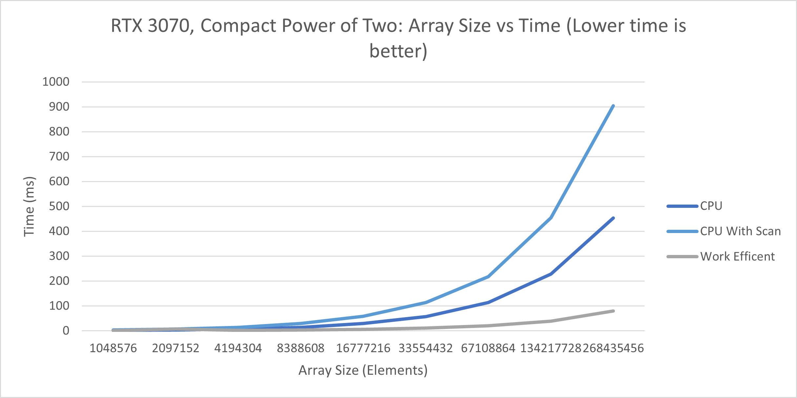

CUDA Stream Compaction
======================

**University of Pennsylvania, CIS 565: GPU Programming and Architecture, Project 2**
  
* Tom Donnelly
  * [LinkedIn](https://www.linkedin.com/in/the-tom-donnelly/)
* Tested on: Windows 11, AMD Ryzen 9 5900X, NVIDIA GeForce RTX 3070 (Personal Desktop)

### Description
An Implementation and Comparison of Stream Compaction and Scan Algorithms for Naive, Work Efficient, Naive, and Thrust implementations on the CPU and GPU.

### Questions and Analysis

## Roughly optimize the block sizes of each of your implementations for minimal run time on your GPU.


Average runtimes were taken for 5 runs at an array of 1048576 elements. A block size of 128 was chosen for the Naive implementation and a block size of 64 was chosen for the efficient implementation.

## Comparison
 
 
 
After around 1048576 elements, the CPU implementation of Scan loses performance taking the most time out of any implementation. The faster implementation is thrust, followed by the work efficient and Naive implementations respectively. This trend occurs both in arrays of a power of two and non power of two arrays. The compact GPU implementation is much faster than the CPU at higher array values, having a 5.7X speedup at 268435456
elements.  
Thrust appears to be calling an asynchronous malloc and memcopy in CUDA to initialize device vectors. It is then calling DeviceScanInitKernal and DeviceScanKernal to implement the exclusive scan. It is likely using shared memory to perform parallel operations quickly.  
### Explanation
All CPU implementations are serialized, meaning they are run one after the other an constrained by the speed of one thread on the CPU. The memory operations are quick so the implementation works well for small arrays but very quickly falls off for larger arrays. The Naive implementation is limited by the access pattern, it launches the maximum number of threads for each offset and is limited by the number of calculations being done. The work efficient implementation launches the minimum number of threads and is likely limited through I/O  global memory on the GPU. It could be improved by using shared memory. The thrust implementation is the fastest and most likely hardware limited.

```

****************
** SCAN TESTS **
****************
    [  39   5  12   8  25  17  10  49   5  23  16  21   3 ...  34   0 ]
==== cpu scan, power-of-two ====
   elapsed time: 0.0006ms    (std::chrono Measured)
    [   0  39  44  56  64  89 106 116 165 170 193 209 230 ... 6408 6442 ]
==== cpu scan, non-power-of-two ====
   elapsed time: 0.0003ms    (std::chrono Measured)
    [   0  39  44  56  64  89 106 116 165 170 193 209 230 ... 6372 6383 ]
    passed
==== naive scan, power-of-two ====
   elapsed time: 0.077664ms    (CUDA Measured)
    [   0  39  44  56  64  89 106 116 165 170 193 209 230 ... 6408 6442 ]
    passed
==== naive scan, non-power-of-two ====
   elapsed time: 0.082944ms    (CUDA Measured)
    passed
==== work-efficient scan, power-of-two ====
   elapsed time: 0.169984ms    (CUDA Measured)
    [   0  39  44  56  64  89 106 116 165 170 193 209 230 ... 6408 6442 ]
    passed
==== work-efficient scan, non-power-of-two ====
   elapsed time: 0.140256ms    (CUDA Measured)
    [   0  39  44  56  64  89 106 116 165 170 193 209 230 ... 6372 6383 ]
    passed
==== thrust scan, power-of-two ====
   elapsed time: 0.052992ms    (CUDA Measured)
    [   0  39  44  56  64  89 106 116 165 170 193 209 230 ... 6408 6442 ]
    passed
==== thrust scan, non-power-of-two ====
   elapsed time: 0.070656ms    (CUDA Measured)
    passed

*****************************
** STREAM COMPACTION TESTS **
*****************************
    [   3   3   2   0   1   3   0   3   3   3   0   1   1 ...   2   0 ]
==== cpu compact without scan, power-of-two ====
   elapsed time: 0.0006ms    (std::chrono Measured)
    [   3   3   2   1   3   3   3   3   1   1   1   1   1 ...   1   2 ]
    passed
==== cpu compact without scan, non-power-of-two ====
   elapsed time: 0.0008ms    (std::chrono Measured)
    [   3   3   2   1   3   3   3   3   1   1   1   1   1 ...   3   1 ]
    passed
==== cpu compact with scan ====
   elapsed time: 0.0014ms    (std::chrono Measured)
    [   3   3   2   1   3   3   3   3   1   1   1   1   1 ...   1   2 ]
    passed
==== work-efficient compact, power-of-two ====
   elapsed time: 0.16896ms    (CUDA Measured)
    passed
==== work-efficient compact, non-power-of-two ====
   elapsed time: 0.218112ms    (CUDA Measured)
    passed
Press any key to continue . . .
```


