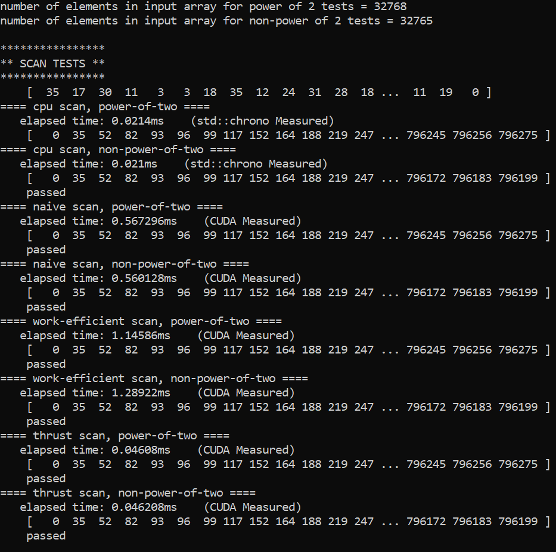

CUDA Stream Compaction
======================

**University of Pennsylvania, CIS 565: GPU Programming and Architecture, Project 2**

* Nick Moon
  * [LinkedIn](https://www.linkedin.com/in/nick-moon1/), [personal website](https://nicholasmoon.github.io/)
* Tested on: Windows 10, AMD Ryzen 9 5900HS @ 3.0GHz 32GB, NVIDIA RTX 3060 Laptop 6GB (Personal Laptop)

**This is a Stream Compaction algorithm implementation in C++ using CUDA for GPU acceleration. This allows for
compacting arrays with millions of elements in parallel on the GPU.**

### Results

#### Array Scan


*Figure 1: Array Scan test results with input array size = 2^25 (33554432).*


*Figure 2: Array Scan test results with input array size = 2^20 (1048576).*


*Figure 3: Array Scan test results with input array size = 2^15 (32768).*

#### Stream Compaction


*Figure 1: Array Scan test results with input array size = 2^25 (33554432).*


*Figure 2: Array Scan test results with input array size = 2^20 (1048576).*


*Figure 3: Array Scan test results with input array size = 2^15 (32768).*


## Implementaion

### Array Scan

The array scan algorithm 

#### CPU Implementation

The CPU implementation implements the array scan algorithm in a serial format, according to the pseudocode

```
function scan_cpu(input_array, output_array, number_of_elements):

    output_array[0] = 0
    for i in range [1, number_of_elements):
        output_array[i] = output_array[i - 1] + input_array[i - 1]

end
```

#### Naive CUDA Implemenation

The Naive CUDA implementation maps the original cpu scan approach and maps it to parallel GPU hardware.
This necessitates the use of double-buffering in order to avoid race conditions. This means swapping the
two gpu arrays that are used as input and output each iteration.

```
function scan_gpu(input_array, output_array, number_of_elements):

    let o_array_gpu_0 = input_array (this is an array on the GPU)
    let o_array_gpu_1 = o_array_gpu_0 (this is an array on the GPU)

    for all k in parallel:
        shift_array_right(k, o_array_gpu_1, o_array_gpu_0)

    for d in range [1, ceil( log_2(n) ) ]:
        for all k in parallel:
            naive_scan_iteration(k, o_array_gpu_0, o_array_gpu_1, 2^d)

end

kernel shift_array_right(thread_ID, input_array, output_array):
    if thread_ID_ == 0 then:
        output_array[0] = 0
    else:
        output_array[thread_ID] = input_array[thread_ID - 1]

end

kernel naive_scan_iteration(thread_ID, input_array, output_array, offset):
    if (thread_ID < offset) then:
        output_array[thread_ID] = input_array[thread_ID]
    else:
        output_array[thread_ID] = input_array[thread_ID - offset] + input_array[thread_ID]
    
end
```

#### Work-Efficient CUDA Implementation

To make the parallel approach more efficient, a different scheme is used. A problem with the previous method is
that 

```
function scan_gpu(input_array, output_array, number_of_elements):

    let o_array_gpu_0 = input_array (this is an array on the GPU)
    let o_array_gpu_1 = o_array_gpu_0 (this is an array on the GPU)

    for all k in parallel:
        shift_array_right(k, o_array_gpu_1, o_array_gpu_0)

    for d in range [1, ceil( log_2(n) ) ]:
        for all k in parallel:
            naive_scan_iteration(k, o_array_gpu_0, o_array_gpu_1, 2^d)

end

kernel shift_array_right(thread_ID, input_array, output_array):
    if thread_ID_ == 0 then:
        output_array[0] = 0
    else:
        output_array[thread_ID] = input_array[thread_ID - 1]

end

kernel naive_scan_iteration(thread_ID, input_array, output_array, offset):
    if (thread_ID < offset) then:
        output_array[thread_ID] = input_array[thread_ID]
    else:
        output_array[thread_ID] = input_array[thread_ID - offset] + input_array[thread_ID]
    
end
```

#### Thrust Implementation

For the thrust implementation, the input and output arrays are simply converted to thrust library
device vectors and the thrust "exclusive_scan()" function is called with them. The thrust device vector
for the output data is then transferred back to the host array.

### Stream Compaction

#### CPU Implementation

#### Extra Credit

I also implemented the extra credit to optimize and parameterize the grid-based looping to handle arbitrary
subgrid lengths. This involved calculating the number of cells needed to be checked in the x,y,z directions of the cell
grid, and then using these values to offset the grid cell indices from the current boid grid cell index. This feature 
is how I generated Figure 7.

## Testing Strategy

The first step in the testing strategy was to figure out the optimal block size for the 
different GPU implementations of the scan and stream compaction algorithms. Data from each
implementation was collected with a constant input array size of 2^25 (33,554,432) for
powers of two block sizes from 32 to 1024, and the resutls are shown in Figure XXX below.


*Figure XXX: Effect of CUDA block size on runtime of scan and stream compaction.*

## Performance Analysis

As can be seen by Figure XXX below, the runtime of the scan algorithm increases linearly for each of the
different implementations, but the slope of this increase is different for each one.


*Figure 5: Effect of input array size on runtiem of scan algorithm.*

Likewise, Figure XXX below shows the runtime of the stream compaction algorithm also increases linearly
for each of the implementations, and again the slope of this increase is the only thing that changes.
However, unlike with scan, here the GPU stream compaction is significantly faster than either of the
CPU implementations for arrays with very large amounts of elements (>2000000).


*Figure 6: Effect of cuda kernel block size on average fps for uniform grid-based simulation*

As a final point of analysis, Figure 7 below displays the effect of changing the grid cell resolution with respect the
maximum neighbor search distance each boid uses to get nearby boids that influence its velocity. As can be shown,
balancing this ratio is important for improving and maintain efficiency, and the benefits of the grid-based system.
Too low a resolution, such as the first data point on the graph, and the performance is suboptimal as a lot of potentially
empty space is being encompassed by large cells. Too high a resolution, and the benefit of the grid-based system is lost.
There are now so many neighboring cells needed to be checked by a single boid, that even the increased potential
prevalence of empty cells is lost. The graph shows that having a resolution approximately equal to the maximum search distance
is optimal.


*Figure 7: Effect of the ratio of grid cell width to boid neighbor max search distance on average FPS*

### Bloopers


*Blooper caused by accessing wrong index values for boid position and velocity arrays*

**For more bloopers, see images/bloopers.**

