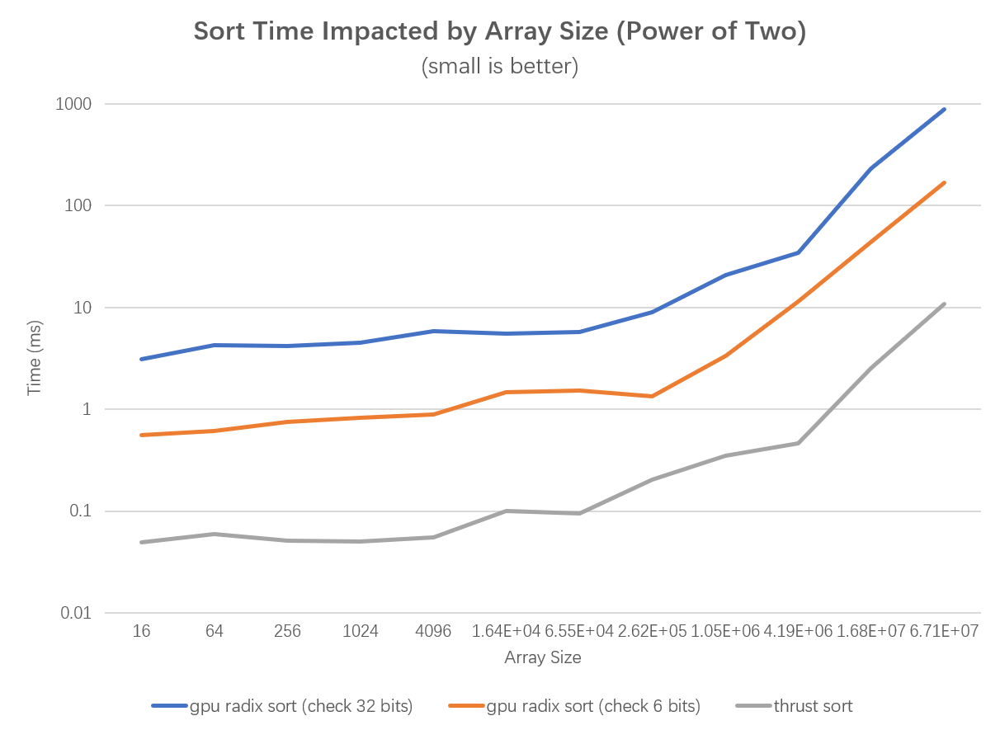

**University of Pennsylvania, CIS 565: GPU Programming and Architecture**

- Alex Fu
  - [LinkedIn](https://www.linkedin.com/in/alex-fu-b47b67238/)
  - [Twitter](https://twitter.com/AlexFu8304)
  - [Personal Website](https://thecger.com/)
- Tested on: Windows 10, i7-10750H @ 2.60GHz, 16GB, GTX 3060 6GB

CUDA Stream Compaction
======================

## Features Implemented

* CPU Scan and Compaction

* Naive GPU Scan

* Work-efficient GPU Scan

* GPU Steam Compaction

* Radix Sort (Extra Credit)
  
  * When input is:
    
    `{41, 17, 34, 0, 19, 24, 28, 8, 12, 14, 5, 45, 31, 27, 11, 41, 45, 42, 27, 36, 41, 4, 2, 3, 42, 32, 21, 16, 18, 45, 47, 26, 21, 38, 19, 12, 17, 49, 35, 44, 3, 11, 22, 33, 23, 14, 41, 11, 3, 18, 47, 44, 12, 7, 37, 9, 23, 41, 29, 28, 16, 35, 40, 0}`,
    
    the output is:
    
     `{0, 0, 2, 3, 3, 3, 4, 5, 7, 8, 9, 11, 11, 11, 12, 12, 12, 14, 14, 16, 16, 17, 17, 18, 18, 19, 19, 21, 21, 22, 23, 23, 24, 26, 27, 27, 28, 28, 29, 31, 32, 33, 34, 35, 35, 36, 37, 38, 40, 41, 41, 41, 41, 41, 42, 42, 44, 44, 45, 45, 45, 47, 47, 49}`.
    
     I also ran the comparison between my radix sort and `thrust::sort` (see [Example Output](#example-output) and [Performance Analysis](#radix-sort)).

### Example Output

</div>

`SIZE` is $2^{20} = 1.05 \times 10 ^ 6$. The test size for non-power-of-two case is `SIZE - 3`. CUDA block size is 128.

```
****************
** SCAN TESTS **
****************
    [  41  17  34   0  19  24  28   8  12  14   5  45  31 ...  20   0 ]
==== cpu scan, power-of-two ====
   elapsed time: 0.5527ms    (std::chrono Measured)
    [   0  41  58  92  92 111 135 163 171 183 197 202 247 ... 25683436 25683456 ]
==== cpu scan, non-power-of-two ====
   elapsed time: 0.5991ms    (std::chrono Measured)
    [   0  41  58  92  92 111 135 163 171 183 197 202 247 ... 25683337 25683375 ]
    passed
==== naive scan, power-of-two ====
   elapsed time: 0.607232ms    (CUDA Measured)
    passed
==== naive scan, non-power-of-two ====
   elapsed time: 0.884736ms    (CUDA Measured)
    passed
==== work-efficient scan, power-of-two ====
   elapsed time: 0.359712ms    (CUDA Measured)
    passed
==== work-efficient scan, non-power-of-two ====
   elapsed time: 0.351232ms    (CUDA Measured)
    passed
==== thrust scan, power-of-two ====
   elapsed time: 0.16576ms    (CUDA Measured)
    passed
==== thrust scan, non-power-of-two ====
   elapsed time: 0.390144ms    (CUDA Measured)
    passed

*****************************
** STREAM COMPACTION TESTS **
*****************************
    [   1   3   2   0   1   0   2   2   2   0   1   1   1 ...   0   0 ]
==== cpu compact without scan, power-of-two ====
   elapsed time: 2.5172ms    (std::chrono Measured)
    [   1   3   2   1   2   2   2   1   1   1   3   1   3 ...   2   3 ]
    passed
==== cpu compact without scan, non-power-of-two ====
   elapsed time: 2.2528ms    (std::chrono Measured)
    [   1   3   2   1   2   2   2   1   1   1   3   1   3 ...   2   2 ]
    passed
==== cpu compact with scan, power-of-two ====
   elapsed time: 4.2481ms    (std::chrono Measured)
    passed
==== cpu compact with scan, non-power-of-two ====
   elapsed time: 4.5622ms    (std::chrono Measured)
    passed
==== work-efficient compact, power-of-two ====
   elapsed time: 0.42496ms    (CUDA Measured)
    passed
==== work-efficient compact, non-power-of-two ====
   elapsed time: 0.42096ms    (CUDA Measured)
    passed

**********************
** RADIX SORT TESTS **
**********************
    [  41  17  34   0  19  24  28   8  12  14   5  45  31 ...  20   0 ]
==== thrust sort, power-of-two ====
   elapsed time: 0.421664ms    (CUDA Measured)
    [   0   0   0   0   0   0   0   0   0   0   0   0   0 ...  49  49 ]
==== thrust sort, non-power-of-two ====
   elapsed time: 0.342016ms    (CUDA Measured)
    [   0   0   0   0   0   0   0   0   0   0   0   0   0 ...  49  49 ]
==== radix sort, power-of-two ====
   elapsed time: 20.2885ms    (CUDA Measured)
    passed
==== radix sort, non-power-of-two ====
   elapsed time: 23.1066ms    (CUDA Measured)
    passed
```

## Performance Analysis

### Performance Impacted by Array Size

CUDA block size is 128.

#### Scan

When array size is small, the CPU implementation is faster than GPU implementation and the fluctuation in GPU implementation time cost is small. When array size is larger than 2.62e5, both thrust function and my work-efficient implementation outperform my CPU implementation.


<!--  -->

#### Compaction

The situation is the same as scan and the turning point is 6.55e4. 


<!--  -->

#### Radix Sort

My implementation of radix sort is very slower than thrust function. 



<!--  -->

### Performance Impacted by CUDA Block Size

`SIZE` is $2^{20} = 1.05 \times 10 ^ 6$.

#### Scan


#### Compaction


#### Radix Sort


## Why is My GPU Approach So Slow?

The optimization I made to the the work-efficient scan is to avoid Warp Partitioning by compressing the threads:


Due to time constraints, I haven't implemeted the shared memory part. I guess this is where the thurst function surpasses mine.

My radix sort (6 bit)'s time cost is about 10 times as much as my work-efficient scan's. This matches my instinct because radix sort will repeate the scan function in each sort. However, I noticed that the time cost of thrust sort function is not 0 times as much as its scan function. For instance, when array size is 65536, the thrust scan costs 0.04ms while sort costs 0.09ms. This drives me to think if there is more optimizations I can do on radix sort.

* Roughly optimize the block sizes of each of your implementations for minimal
  run time on your GPU.
  
  * See [Performance Analysis](#performance-impacted-by-cuda-block-size).

* 

## Some mistakes I made

* At first I put the for loop inside the kernel functions and used a `__syncthreads()` at the begining of each iteration. However, since `__syncthreads()` is block-wise, my result went wrong when the array size exceeded my block size. Then I put the for loop outside the kernel functions.
