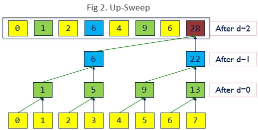

CUDA Stream Compaction
======================

**University of Pennsylvania, CIS 565: GPU Programming and Architecture, Project 2**

* Evan S
* Tested on: Moore Lab Computer - Windows 10, i7-12700 @ 2.10 GHz, NVIDIA T1000

## Background
Stream compaction, in parallel computing, refers to idea of taking a given input stream and compacting it into a smaller output, according to some pre-defined, binary heuristic.  

In our case, we explore stream compaction in the case of simply removing 0s from an input stream.  
 
Below is a example of how a work-efficient GPU implementation works. 
      
<sub><sup>Source: [GPU Gems 3](https://developer.nvidia.com/gpugems/gpugems3/part-vi-gpu-computing/chapter-39-parallel-prefix-sum-scan-cuda)</sup></sub>

We explore a few options for the scan step: serially on the CPU, naively with GPU global memory, work-efficiently with GPU global memory, and with the NVIDIA thrust library.   
For the stream compaction itself, we benchmark serially on the CPU and work-efficiently on the GPU.  

Below is an example of the efficient GPU scan step we implement, occuring first in an "upsweep", followed by a "downsweep":      
 
     
<sub><sup>Source: [GPU Gems 3](https://developer.nvidia.com/gpugems/gpugems3/part-vi-gpu-computing/chapter-39-parallel-prefix-sum-scan-cuda)</sup></sub>

## Performance Analysis
All following benchmarks are performed with powers of two.


While the naive CPU implementation is better than the GPU implementations for a smaller number of elements, it is quickly overtaken by the efficient GPU implementation as the number of elements grows larger. The Naive GPU implementation performs generally even worse than CPU.  
The thrust library, which I expect is implemented using GPU shared memory, is far more efficient than either of the other three implementations, which is fully expected, and it even beats CPU at smaller array sizes.

My GPU implementations are generally bottlenecked by the need to copy memory back and forth. This cripples the overall runtime, and although the efficient algorithm eventually pulls ahead, the performance of the thrust library suggests an enormous benefit to a shared memory implementation.
A closer look at thrust's exclusive_scan() implementation indicates some call is made to cudaMemcpyAsync(); from an [NVIDIA developer blog post](https://developer.nvidia.com/blog/how-overlap-data-transfers-cuda-cc/), I suspect that this allows the thrust implementation to achieve some kind of additional processing parallelism.

The following stream compaction chart has the CPU use its own serialized scan, as noted above.


This is much the same as the scan graph. Initially, the CPU has an advantage, but eventually the GPU outperforms the CPU on large arrays.

## Example program output
```
****************
** SCAN TESTS **
****************
    [  36  16  48  19  21   0  29  10  37   6  26  42  18 ...  23   0 ]
==== cpu scan, power-of-two ====
   elapsed time: 1.6207ms    (std::chrono Measured)
    [   0  36  52 100 119 140 140 169 179 216 222 248 290 ... 51365056 51365079 ]
==== cpu scan, non-power-of-two ====
   elapsed time: 1.4579ms    (std::chrono Measured)
    [   0  36  52 100 119 140 140 169 179 216 222 248 290 ... 51364938 51364970 ]
    passed
==== naive scan, power-of-two ====
   elapsed time: 4.93562ms    (CUDA Measured)
    [   0  36  52 100 119 140 140 169 179 216 222 248 290 ... 51365056 51365079 ]
    passed
==== naive scan, non-power-of-two ====
   elapsed time: 4.45357ms    (CUDA Measured)
    [   0  36  52 100 119 140 140 169 179 216 222 248 290 ... 51364938 51364970 ]
    passed
==== work-efficient scan, power-of-two ====
   elapsed time: 2.88218ms    (CUDA Measured)
    [   0  36  52 100 119 140 140 169 179 216 222 248 290 ... 51365056 51365079 ]
    passed
==== work-efficient scan, non-power-of-two ====
   elapsed time: 3.25632ms    (CUDA Measured)
    [   0  36  52 100 119 140 140 169 179 216 222 248 290 ... 51364938 51364970 ]
    passed
==== thrust scan, power-of-two ====
   elapsed time: 0.292992ms    (CUDA Measured)
    [   0  36  52 100 119 140 140 169 179 216 222 248 290 ... 51365056 51365079 ]
    passed
==== thrust scan, non-power-of-two ====
   elapsed time: 0.249472ms    (CUDA Measured)
    [   0  36  52 100 119 140 140 169 179 216 222 248 290 ... 51364938 51364970 ]
    passed

*****************************
** STREAM COMPACTION TESTS **
*****************************
    [   0   2   2   3   3   2   3   0   3   0   2   0   0 ...   3   0 ]
==== cpu compact without scan, power-of-two ====
   elapsed time: 4.0349ms    (std::chrono Measured)
    [   2   2   3   3   2   3   3   2   3   1   3   1   3 ...   1   3 ]
    passed
==== cpu compact without scan, non-power-of-two ====
   elapsed time: 3.9397ms    (std::chrono Measured)
    [   2   2   3   3   2   3   3   2   3   1   3   1   3 ...   3   1 ]
    passed
==== cpu compact with scan ====
   elapsed time: 6.1313ms    (std::chrono Measured)
    [   2   2   3   3   2   3   3   2   3   1   3   1   3 ...   1   3 ]
    passed
==== work-efficient compact, power-of-two ====
   elapsed time: 3.21997ms    (CUDA Measured)
    [   2   2   3   3   2   3   3   2   3   1   3   1   3 ...   1   3 ]
    passed
==== work-efficient compact, non-power-of-two ====
   elapsed time: 3.19434ms    (CUDA Measured)
    [   2   2   3   3   2   3   3   2   3   1   3   1   3 ...   3   1 ]
    passed
```