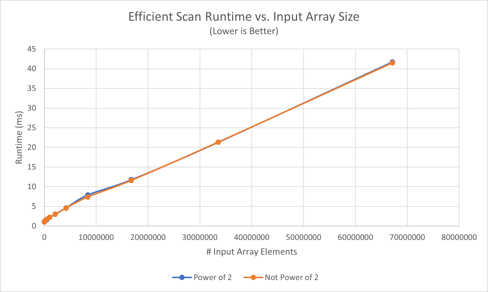

CUDA Stream Compaction
======================

**University of Pennsylvania, CIS 565: GPU Programming and Architecture, Project 2**

* Nick Moon
  * [LinkedIn](https://www.linkedin.com/in/nick-moon1/), [personal website](https://nicholasmoon.github.io/)
* Tested on: Windows 10, AMD Ryzen 9 5900HS @ 3.0GHz 32GB, NVIDIA RTX 3060 Laptop 6GB (Personal Laptop)

**This is a Stream Compaction algorithm implementation in C++ using CUDA for GPU acceleration. This allows for
compacting arrays with millions of elements in parallel on the GPU.**

### Results

*Testbench functional and performance results for scan and stream compaction on input array size of 2^25 (33554432):*
```
number of elements in input array for power of 2 tests = 33554432
number of elements in input array for non-power of 2 tests = 33554429

****************
** SCAN TESTS **
****************
    [  34  41  19  15   6   8   5  37  47  15   4  40  20 ...  44  16   0 ]
==== cpu scan, power-of-two ====
   elapsed time: 19.1805ms    (std::chrono Measured)
    [   0  34  75  94 109 115 123 128 165 212 227 231 271 ... 821815873 821815917 821815933 ]
==== cpu scan, non-power-of-two ====
   elapsed time: 19.9557ms    (std::chrono Measured)
    [   0  34  75  94 109 115 123 128 165 212 227 231 271 ... 821815825 821815842 821815853 ]
    passed
==== naive scan, power-of-two ====
   elapsed time: 29.1328ms    (CUDA Measured)
    [   0  34  75  94 109 115 123 128 165 212 227 231 271 ... 821815873 821815917 821815933 ]
    passed
==== naive scan, non-power-of-two ====
   elapsed time: 29.0673ms    (CUDA Measured)
    [   0  34  75  94 109 115 123 128 165 212 227 231 271 ... 821815825 821815842 821815853 ]
    passed
==== work-efficient scan, power-of-two ====
   elapsed time: 24.446ms    (CUDA Measured)
    [   0  34  75  94 109 115 123 128 165 212 227 231 271 ... 821815873 821815917 821815933 ]
    passed
==== work-efficient scan, non-power-of-two ====
   elapsed time: 21.2756ms    (CUDA Measured)
    [   0  34  75  94 109 115 123 128 165 212 227 231 271 ... 821815825 821815842 821815853 ]
    passed
==== thrust scan, power-of-two ====
   elapsed time: 1.16003ms    (CUDA Measured)
    [   0  34  75  94 109 115 123 128 165 212 227 231 271 ... 821815873 821815917 821815933 ]
    passed
==== thrust scan, non-power-of-two ====
   elapsed time: 1.17952ms    (CUDA Measured)
    [   0  34  75  94 109 115 123 128 165 212 227 231 271 ... 821815825 821815842 821815853 ]
    passed

*****************************
** STREAM COMPACTION TESTS **
*****************************
    [   2   3   3   0   0   1   1   0   3   1   0   1   1 ...   2   0   0 ]
==== cpu compact without scan, power-of-two ====
   elapsed time: 51.9551ms    (std::chrono Measured)
    [   2   3   3   1   1   3   1   1   1   3   2   2   2 ...   2   3   2 ]
    passed
==== cpu compact without scan, non-power-of-two ====
   elapsed time: 51.9623ms    (std::chrono Measured)
    [   2   3   3   1   1   3   1   1   1   3   2   2   2 ...   3   2   3 ]
    passed
==== cpu compact with scan ====
   elapsed time: 103.018ms    (std::chrono Measured)
    [   2   3   3   1   1   3   1   1   1   3   2   2   2 ...   2   3   2 ]
    passed
==== work-efficient compact, power-of-two ====
   elapsed time: 25.3891ms    (CUDA Measured)
    [   2   3   3   1   1   3   1   1   1   3   2   2   2 ...   2   3   2 ]
    passed
==== work-efficient compact, non-power-of-two ====
   elapsed time: 25.2508ms    (CUDA Measured)
    [   2   3   3   1   1   3   1   1   1   3   2   2   2 ...   3   2   3 ]
    passed
```


## Implementation

### Array Scan

The array scan algorithm is an algorithm that, given an input array of ints ```idata``` of size n, 
will output an an array ```odata``` with size also n, where the value at each 
index ```i``` in ```odata``` is the sum of all previous ```i-1``` elements from ```idata```.
Exclusive scan is the version implemented in this repository, as opposed to Inclusive. This means 
setting ```odata[0] = 0``` and each element in ```odata``` not including the addition of 
its correpsonding value in ```idata``` when computing the value. Below each of the different
implementations of the exclusive scan algorithm are talked in more detail.

#### CPU Implementation

The CPU implementation implements the array scan algorithm in a serial format, according to the pseudocode:

```
function scan_cpu(input_array, output_array, number_of_elements):

    output_array[0] = 0
    for i in range [1, number_of_elements):
        output_array[i] = output_array[i - 1] + input_array[i - 1]

end
```

#### Naive CUDA Implemenation

The Naive CUDA implementation maps the original cpu scan approach and maps it to parallel GPU hardware.
This necessitates the use of double-buffering in order to avoid race conditions. This means swapping the
two gpu arrays that are used as input and output each iteration.

```
function scan_gpu(input_array, output_array, number_of_elements):

    let o_array_gpu_0 = input_array (this is an array on the GPU)
    let o_array_gpu_1 = o_array_gpu_0 (this is an array on the GPU)

    for all k in parallel:
        shift_array_right(k, o_array_gpu_1, o_array_gpu_0)

    for d in range [1, ceil( log_2(n) ) ]:
        for all k in parallel:
            naive_scan_iteration(k, o_array_gpu_0, o_array_gpu_1, 2^d)

end

kernel shift_array_right(thread_ID, input_array, output_array):
    if thread_ID_ == 0 then:
        output_array[0] = 0
    else:
        output_array[thread_ID] = input_array[thread_ID - 1]

end

kernel naive_scan_iteration(thread_ID, input_array, output_array, offset):
    if (thread_ID < offset) then:
        output_array[thread_ID] = input_array[thread_ID]
    else:
        output_array[thread_ID] = input_array[thread_ID - offset] + input_array[thread_ID]
    
end
```

#### Work-Efficient CUDA Implementation

To make the parallel approach more efficient, a different scheme is used. By treating the array
as a balanced binary tree, the new approach seperates out the algorithm into two steps: the
up-sweep and the down-sweep. The up-sweep is just a parallel reduction, which just stores the
sum of an array in the last index. A picture of the up-sweep on an example array is shown in Figure
1 below:


*Figure 1: Demonstration of efficient scan up-sweep operation.*

After the up-sweep, the element at the last index (the sum of the array) is zeroed out, and then
the down-sweep occurs, as seen in Figure 2 below:


*Figure 2: Demonstration of efficient scan down-sweep operation.*

#### Thrust Implementation

For the thrust implementation, the input and output arrays are simply converted to thrust library
```device_vector```s and the thrust ```exclusive_scan()``` function is called with them. The thrust device vector
for the output data is then transferred back to the host array.

### Stream Compaction

Stream compaction is an array algorithm that, given an input array of ints ```idata``` of size ```n```,
returns an output array ```odata``` of some size ```[0,n]``` such that ```odata``` contains only the
values ```x``` in ```idata``` that satisfy some criteria function ```f(x)```. This is essentially 
used to compact an array into a smaller size by getting rid of unneeded elements as determined by 
the criteria function ```f(x)```. Values for which ```f(x)``` return ```true``` are kept, while
values for which ```f(x)``` return false are removed.

#### CPU Implementation (without scan)

The CPU implementation (without scan) implements the stream compaction algorithm in a serial format,
according to the pseudocode:

```
function stream_compact_cpu_no_scan(input_array, output_array, number_of_elements):

    let num_compacted_elements = 0
    for i in range [0, number_of_elements):
        if input_array[i] != 0 then:
            output_array[num_compacted_elements] = input_array[i]
            num_compacted_elements = num_compacted_elements + 1

    return num_elements

end
```

This method keeps a rolling index while looping through the input array that keeps track of what index
into the output array to write to, only writing to that index when a value in the input array
satisfies the condition function, which in this case is ```x != 0```.

#### CPU Implementation (with scan)

The CPU implementation (with scan) implements the stream compaction algorithm in a "pseudo"-parallel format,
meaning that the structure of the algorithm mimics what will be used for the CUDA implementation,
but still operates on the array serially. This involves a (serial) pass to check for each element in
the input array that is not 0, running a (serial) scan on this data, and then running a (serial) scatter
on the scan result to build the final output array. The psuedocode is below:

```
function stream_compact_cpu_scan(input_array, output_array, number_of_elements):

    let num_compacted_elements = 0

    // GENERATE CONDITION VALUES

    for i in range [0, number_of_elements):
        if input_array[i] == 0 then:
            output_array[i] = 0
        else:
            output_array[i] = 1

    // SCAN

    let temp_array[number_of_elements]
    temp_array[0] = 0;

    for i in range [1, number_of_elements):
        temp_array[i] = temp_array[i - 1] + output_array[i - 1]

    // SCATTER

    for i in range [0, number_of_elements):
        if output_array[i] == 1 then:
            output_array[temp_array[i]] = input_array[i];
            ++num_compacted_elements;
        }

    return num_compacted_elements

end
```

#### Efficient Parallel Implementation

The GPU version of this algorithm directly models the CPU with scan version, except this time the 3
steps, the condition check, the scan, and the scatter, are all performed on the GPU. The scan
function is the same as for the efficient parallel scan from the previous section, while the pseudocode
for the other two functions are shown below:

```

kernel map_to_boolean(thread_ID, input_array, output_array):

    if input_array[thread_ID] == 0 then:
        output_array[thread_ID] = 0
    else:
        output_array[thread_ID] = 1

end

kernel scatter(thread_ID, input_array, output_array, boolean_array, indices_array):

    if boolean_array[thread_ID] == 1 then:
        output_data[indices_array[thread_ID]] = input_array[thread_ID]
    
end
```

### Extra Credit

I implemented the CPU radix sort but did not end up finishing my GPU version.

## Testing Strategy

**All tests and results are done on Release mode in Visual Studio**

The first step in generating results was to figure out the optimal block size for the 
different GPU implementations of the scan and stream compaction algorithms. Data from each
implementation was collected with a constant input array size of 2^25 (33,554,432) for
powers of two block sizes from 32 to 1024, and the results are shown in Figure 3 below.


*Figure 3: Effect of CUDA block size on runtime of scan and stream compaction.*

As seen from the graph, for both exclusive scan and stream compaction, the optimal block size is
around 128-256. Below these values, the runtime shoots up exponentially with decreasing block size,
getting as high as almost 4x worse performance at a block size of 32 compared to 256 for the parallel
stream compaction on an array with a size not a power of 2.
Similarly, the performance also increases with increasing block size past 256, at least for all the
algorithms save the naive scan. This growth appears roughly linear for the other algorithms,
while the runtime stays roughly constant for the naive scan.

To be more specific, the block size with the lowest runtime and thus the **optimal block size** of
the **naive parallel scan is 128**, and for **all others is 256**. These values will thus be used to test
and retrieve results for the forthcoming topics of discussion.

In the **Performance Analysis** section below, all data is from the ***Not Power of 2 Array Size*** tests.
This is because this is the most general test case for analyzing these algorithms, as most often an
array will not fit neatly into the CUDA blocks. Additionally, there is negligable difference in the
runtimes between the power of 2 and non-power of 2 tests. This can be seen in Figure 4 below:


*Figure 4: Demonstrating runtime comparison between tests on arrays with power of 2 size and not.*

## Performance Analysis

**All tests and results are done on Release mode in Visual Studio**

### Scan

As can be seen by Figure 5 below, the runtime of the scan algorithm increases roughly linearly for each of the
different implementations, but the slope of this increase is different for each one. 

The thrust version was by far the fastest in most cases and had the smallest slope. 
In all test cases, the thrust version maintained a runtime below 3ms. This makes sense, as thrust is
a highly optimized GPU and parallel algorithm library developed for high performance applications.
As to its amazing performance relative the CUDA implementations found in this repository,
that will be discussed further down the readme.

The next best version was the CPU scan. While this is initially suprising, there are a couple benefits
the CPU version has with respect to the GPU versions. First, the logic is very simple for computing
each element of the output, and the serial nature of the algorithm means it is very cache coherent.
It also requires no additional memory allocation (CPU or GPU), which all the parallel versions require.

The work-efficient parallel scan is the next best version. This is slower than the CPU and thrust versions,
but faster than the naive parallel version in the long run. The reason this is slower than the CPU
version is, first of all, because it is just using global memory. This is the GPU memory with the highest
latency, and, especially when compared with the CPU version's cache coherency, is a huge bottleneck
on the algorithm. Another problem is that the number of threads remains constant each iteration of the
algorithm. This means that, during both the up sweep and down sweep, there are potentially millions of
threads allocated for a process (i.e. one of the last data points on the graph), while only 1 or a few
are actually active at a time. A more optimized version of the algorithm would allocate only the
threads that are needed.

Finally, the naive parallel scan is the worst version. For 33 million array size, this algorithm
is 50% worse than the efficient parallel scan, and 30x slower than the thrust library implementation. 
This is mostly due to a couple factors. First, the naive parallel algorithm never decreases the amount
of threads (number of blocks) launched for the kernels, which means at the final iteration, there are
millions of threads (for the final data point) being launched, and only half of them are actually doing
work. Another problem is that the number of active threads for each iteration is only being decreased
by a number that doubles each time. This means that, compared with the efficient version that halves
the number of active threads each iteration, the naive approach will only decrease the number by a
power of two. A final problem with this approach is that it requires double buffering, meaning
at least double the memory of the efficient version, along with the memory latency that comes with
that much additional memory usage.


*Figure 5 Effect of input array size on runtime of scan algorithm.*

##### Thrust NSight Analysis

Taking a little deeper look into the Thrust version of Exclusive Scan, the NSight profiling timeline
seen in Figures 6 and 7
reveal that it consists of at least 1 ```cudaEventCreate``` API call, as well as 3 ```cudaMemcpyAsync```
calls. Two of these ```cudaMemcpyAsync``` calls are performed as part of the casting the input and output
arrays from C style arrays to Thrust ```device_vector```,  and the third is from retrieving the output
data from the output ```device_vector``` and placing it into the output C style array. In between
the first two ```cudaMemcpyAsync``` calls and the third, are ```cudaMalloc```, 
```cudaStreamSynchronize```, and ```cudaFree``` function calls. This is where the actual implementation
of the Thrust Exclusive Scan function is, where it allocates device memory, operates on the data, and then
frees it at the end.


*Figure 6: NSight Timeline of Thrust Exclusive Scan operation highlighting cudaMemcpyAsync.*


*Figure 7: NSight Timeline of Thrust Exclusive Scan operation highlighting cudaStreamSynchronize.*

### Stream Compaction

Likewise, Figure 8 below shows the runtime of the stream compaction algorithm also increases linearly
for each of the implementations, and again the slope of this increase is the only thing that changes.
However, unlike with scan, here the GPU stream compaction is significantly faster than either of the
CPU implementations for arrays with very large amounts of elements (>2000000). This is because
the CPU version (without scan), even though it is logically barely more complex than the CPU scan (which
was faster than the GPU scans), has a conditional in the for loop. Because the array the stream 
compaction input array has elements which are not related in any way to each other, in the worst
case the array would have alternating elements that are ```0``` and not ```0```, causing the branch
prediction in the CPU to cause large performance penalties with increasing array sizes. By parallelizing
these conditionals, the GPU implementation of stream compaction has much faster runtime for array sizes
in the millions.


*Figure 8: Effect of input array size on runtime of stream compaction algorithm*

### Bloopers

No bloopers for this assignment!

