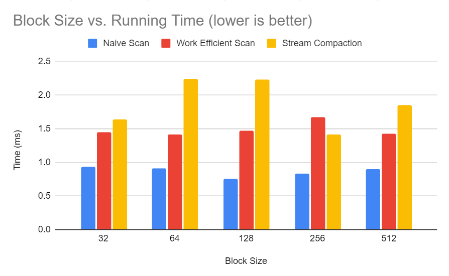
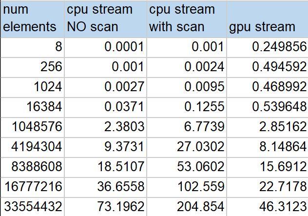
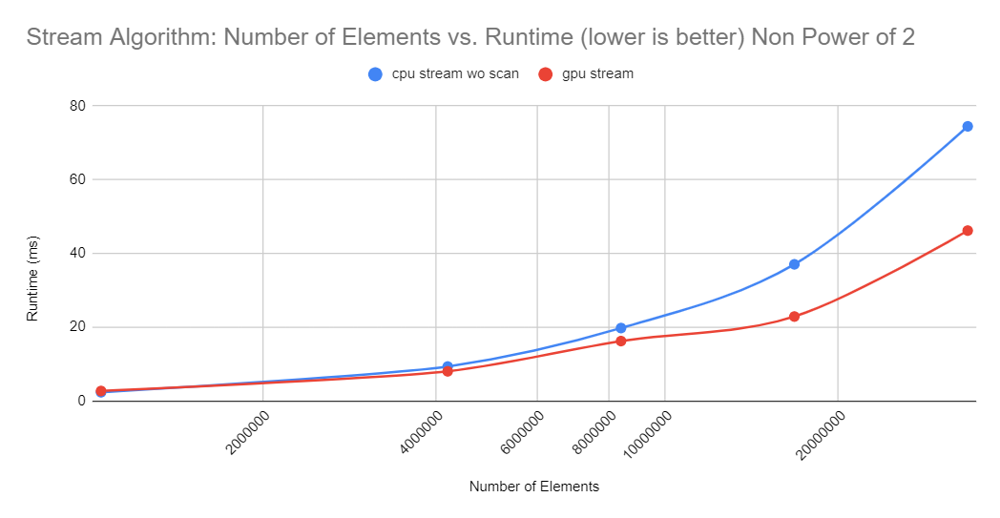

University of Pennsylvania, CIS 565: GPU Programming and Architecture, Project 2 - CUDA Stream Compaction
======================

**University of Pennsylvania, CIS 565: GPU Programming and Architecture, Project 2**

* Di Lu
  * (TODO) [LinkedIn](), [personal website](), [twitter](), etc.
* Tested on: Windows 11, i7-12700H @ 2.30GHz 32GB, NVIDIA GeForce RTX 3050 Ti

## Introduction

In this project, I implemented the following algorithms on the GPU and tested them:

1. Exclusive Scan (CPU, Naive Scan, Work-Efficient Scan, Thrust Scan) - given an array A, output another array B such that each element b\[i\]
is a sum of a\[0\] + ... + a\[i - 1\] excluding itself.
2. Stream Compaction - given an array A, output another array B that only contains elements from A which match a criteria.

## Implementation and Results
#### CPU: Sequential Scan 

* On the CPU, a sequential scan consists of a simple for-loop that loops through all the elements
of input array A, and outputs to B[i] = B[i - 1] + A[i - 1]

#### CPU: Stream Compact without Scan

* Stream compact without Scan will simply keep a counter of the current write-index in the output array B, 
while iterating through input array A. If A[i] != 0, then B[output_index] = A[i].

#### CPU: Stream Compact with Scan

* Stream compact with scan is a sequential implementation of the stream compact algorithm for GPU, except on the CPU
and thus none of the advantages of parallel programming will come into play. See the following section for GPU stream
compaction algorithms. 

#### GPU: Naive GPU Scan

* A naive GPU scan will take an input array (or read array), and add each sequential pair of elements together
into an output array (or write array), ping-pong the arrays (read is now write and vice versa), increment the
additive offset, and then repeat the operation until there is only one output (the final sum). Here, each addition
can be done in a parallel manner since we will never write to the same array slot. The only caveat is that you must
wait for each level to finish its read/write before moving on to the next level.

#### GPU: Work-Efficient GPU Scan

* A work efficient exclusive GPU scan uses only one array and can do the operation in place. This array is treated as a balanced
binary tree, where the left child always retains its original value from the read array. This will allow us to 
retain some of the original values to help us recover the entire scan array after we do a down sweep.

1. Up Sweep
For each consecutive pair of integers, add them and store the sum in the right-side partner's slot, overwriting it.
Do this until you only have two partners to add with one resulting sum, which will be written to the last array slot.
Now your array should have alternating "original" and "new" values. 

3. Down Sweep
Set the last integer in the array to 0. This is your root node. Starting from the root, set a node's left child to itself, 
and sets its right child's value to a sum of itself and the previous left child's value (i.e, the sibling node's value).

#### GPU: Thrust Scan

* This scan is fairly simple to implement, as thrust::scan is a built-in function in the Thrust library.

#### GPU: Stream Compaction

* On the GPU, stream compaction consists of the following steps: 

1. For each element in A, compute a "boolean" array such that: b[i] = 1 if A[i] meets the criteria, and b[i] = 0 otherwise.
2. Run exclusive scan on the boolean array b to produce array s.
3. The final output array is computed such that: if b[i] = 1, then write A[i] to index s[i] in the output array.

## Output Example

The following is an example of the output for N = 2^20
```
****************
** SCAN TESTS **
****************
    [  18  19  38  39  17  17  11  34   0  18  47  37  37 ...   2   0 ]
==== cpu scan, power-of-two ====
   elapsed time: 2.1343ms    (std::chrono Measured)
    [   0  18  37  75 114 131 148 159 193 193 211 258 295 ... 25679509 25679511 ]
==== cpu scan, non-power-of-two ====
   elapsed time: 2.0678ms    (std::chrono Measured)
    [   0  18  37  75 114 131 148 159 193 193 211 258 295 ... 25679459 25679462 ]
    passed
==== naive scan, power-of-two ====
blockSize: 256
   elapsed time: 1.40179ms    (CUDA Measured)
    [   0  18  37  75 114 131 148 159 193 193 211 258 295 ... 25679509 25679511 ]
    passed
==== naive scan, non-power-of-two ====
blockSize: 256
   elapsed time: 1.40688ms    (CUDA Measured)
    [   0  18  37  75 114 131 148 159 193 193 211 258 295 ...   0   0 ]
    passed
==== work-efficient scan, power-of-two ====
blockSize: 256
   elapsed time: 1.63549ms    (CUDA Measured)
    [   0  18  37  75 114 131 148 159 193 193 211 258 295 ... 25679509 25679511 ]
    passed
==== work-efficient scan, non-power-of-two ====
blockSize: 256
   elapsed time: 1.6831ms    (CUDA Measured)
    [   0  18  37  75 114 131 148 159 193 193 211 258 295 ... 25679459 25679462 ]
    passed
==== thrust scan, power-of-two ====
   elapsed time: 0.404608ms    (CUDA Measured)
    [   0  18  37  75 114 131 148 159 193 193 211 258 295 ... 25679509 25679511 ]
    passed
==== thrust scan, non-power-of-two ====
   elapsed time: 0.3792ms    (CUDA Measured)
    [   0  18  37  75 114 131 148 159 193 193 211 258 295 ... 25679459 25679462 ]
    passed

*****************************
** STREAM COMPACTION TESTS **
*****************************
    [   0   1   2   3   1   1   1   2   0   0   3   3   3 ...   0   0 ]
==== cpu compact without scan, power-of-two ====
   elapsed time: 2.3575ms    (std::chrono Measured)
    [   1   2   3   1   1   1   2   3   3   3   1   2   2 ...   1   1 ]
    passed
==== cpu compact without scan, non-power-of-two ====
   elapsed time: 2.4421ms    (std::chrono Measured)
    [   1   2   3   1   1   1   2   3   3   3   1   2   2 ...   1   1 ]
    passed
==== cpu compact with scan ====
   elapsed time: 6.5362ms    (std::chrono Measured)
    [   1   2   3   1   1   1   2   3   3   3   1   2   2 ...   1   1 ]
    passed
==== work-efficient compact, power-of-two ====
blockSize: 256
   elapsed time: 3.06957ms    (CUDA Measured)
    [   1   2   3   1   1   1   2   3   3   3   1   2   2 ...   1   1 ]
    passed
==== work-efficient compact, non-power-of-two ====
blockSize: 256
   elapsed time: 2.88675ms    (CUDA Measured)
    [   1   2   3   1   1   1   2   3   3   3   1   2   2 ...   1   1 ]
    passed
```

## Testing Methods

To test my program, each run of the program will produce a random array of numbers between a given
range. I varied the length of my arrays from size 4 up to 2^25. I also tried arrays with and without
a 0 at the very end.

## Performance Analysis

* Roughly optimize the block sizes of each of your implementations for minimal
  run time on your GPU.
  * In the following performance analysis, I used N = 2^25 array size
  
  
  
    _Table. 1 Blocksize vs. Results for each algorithm_
    
  
  
  _Fig. 1 Blocksize vs. Results for each algorithm_

* Compare all of these GPU Scan implementations (Naive, Work-Efficient, and
  Thrust) to the serial CPU version of Scan. Plot a graph of the comparison
  (with array size on the independent axis).
 #### Scan
  
  
  _Table. 2 Scan Algorithm: Number of Elements vs. Results_
  
  
  
   _Fig. 2 Scan Algorithm: Number of Elements vs. Results Power of 2_
    
  
  
  _Fig. 3 Scan Algorithm: Number of Elements vs. Results NON Power of 2_
  
  In Scan, the performance results between Non-Power of 2 arrays and power of 2 arrays are fairly similar.
  As expected, CPU scan is the least efficient algorithm when there are many elements. Naive scan is slightly
  more efficient, although not by a lot. Efficient GPU scan does technically run faster than CPU and Naive, but 
  the effects are not seen unless the size of the input array is above 1.5 million. Thrust scan is the fastest
  out of all of them. 

* Write a brief explanation of the phenomena you see here.
  * Can you find the performance bottlenecks? Is it memory I/O? Computation? Is
    it different for each implementation?
    
I am not surprised that the GPU efficient implementation isn't faster until the size of the input array gets
    significantly large. This is because I didn't optimize my implementations to ensure that threads are not idling. 
    For example, I'm only using every other thread, then every 4 threads, etc. during scan. A way to bypass this is to
    launch fewer threads, but computing the destination it should go to based on its idx and the current up-sweep or
    down-sweep index.
    
Additionally, I ensured that my GPU timers included as few cudaMallocs, Memcpys, and Memsets as possible, but it's not
    always feasible to move all of them outside of my "main" algorithm code, so to speak. For example, I need to call 
    cudaMalloc on an array where I only know its length after a value is computed during the algorithm. Hence, I can only cudaMalloc
    within the algorithm.
    
  * To guess at what might be happening inside the Thrust implementation (e.g.
    allocation, memory copy), take a look at the Nsight timeline for its
    execution. Your analysis here doesn't have to be detailed, since you aren't
    even looking at the code for the implementation.
    
    
  
 #### Stream Compaction
  
  
  _Table. 3 Stream Compaction Algorithm: Number of Elements vs. Results_
  
  
  
  _Fig. 4 Stream Algorithm: Number of Elements vs. Results Power of 2_
  
  
  
  _Fig. 5 Steram Algorithm: Number of Elements vs. Results NON Power of 2_

* Paste the output of the test program into a triple-backtick block in your
  README.
  * See above

These questions should help guide you in performance analysis on future
assignments, as well.

## NSight Performance Confusion

When running my program in Nsight, the results are extremely fast for N = 2^25 compared to 
Release mode in Visual Studio. I'm not exactly sure why.

```****************
** SCAN TESTS **
****************
    [  17  20  19   7  22  46  11   3  35  15  31  39  34 ...  20   0 ]
==== cpu scan, power-of-two ====
   elapsed time: 2.0798ms    (std::chrono Measured)
    [   0  17  37  56  63  85 131 142 145 180 195 226 265 ... 25666495 25666515 ]
==== cpu scan, non-power-of-two ====
   elapsed time: 2.0982ms    (std::chrono Measured)
    [   0  17  37  56  63  85 131 142 145 180 195 226 265 ... 25666419 25666467 ]
    passed
==== naive scan, power-of-two ====
blockSize: 256
   elapsed time: 1.716ms    (CUDA Measured)
    [   0  17  37  56  63  85 131 142 145 180 195 226 265 ... 25666495 25666515 ]
    passed
==== naive scan, non-power-of-two ====
blockSize: 256
   elapsed time: 2.00374ms    (CUDA Measured)
    [   0  17  37  56  63  85 131 142 145 180 195 226 265 ...   0   0 ]
    passed
==== work-efficient scan, power-of-two ====
blockSize: 256
   elapsed time: 2.3617ms    (CUDA Measured)
    [   0  17  37  56  63  85 131 142 145 180 195 226 265 ... 25666495 25666515 ]
    passed
==== work-efficient scan, non-power-of-two ====
blockSize: 256
   elapsed time: 2.23104ms    (CUDA Measured)
    [   0  17  37  56  63  85 131 142 145 180 195 226 265 ... 25666419 25666467 ]
    passed
==== thrust scan, power-of-two ====
   elapsed time: 0.567744ms    (CUDA Measured)
    [   0  17  37  56  63  85 131 142 145 180 195 226 265 ... 25666495 25666515 ]
    passed
==== thrust scan, non-power-of-two ====
   elapsed time: 0.566816ms    (CUDA Measured)
    [   0  17  37  56  63  85 131 142 145 180 195 226 265 ... 25666419 25666467 ]
    passed

*****************************
** STREAM COMPACTION TESTS **
*****************************
    [   3   2   3   1   2   0   1   3   3   3   1   1   0 ...   0   0 ]
==== cpu compact without scan, power-of-two ====
   elapsed time: 2.3101ms    (std::chrono Measured)
    [   3   2   3   1   2   1   3   3   3   1   1   3   1 ...   2   2 ]
    passed
==== cpu compact without scan, non-power-of-two ====
   elapsed time: 2.2745ms    (std::chrono Measured)
    [   3   2   3   1   2   1   3   3   3   1   1   3   1 ...   2   2 ]
    passed
==== cpu compact with scan ====
   elapsed time: 6.392ms    (std::chrono Measured)
    [   3   2   3   1   2   1   3   3   3   1   1   3   1 ...   2   2 ]
    passed
==== work-efficient compact, power-of-two ====
blockSize: 256
   elapsed time: 4.70064ms    (CUDA Measured)
    [   3   2   3   1   2   1   3   3   3   1   1   3   1 ...   2   2 ]
    passed
==== work-efficient compact, non-power-of-two ====
blockSize: 256
   elapsed time: 3.8247ms    (CUDA Measured)
```


