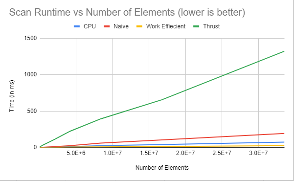

CUDA Stream Compaction
======================

**University of Pennsylvania, CIS 565: GPU Programming and Architecture, Project 2**

* Guanlin Huang
  * [LinkedIn](https://www.linkedin.com/in/guanlin-huang-4406668502/), [personal website](virulentkid.github.io/personal_web/index.html)
* Tested on: Windows 11, i9-10900K @ 4.9GHz 32GB, RTX3080 10GB; Compute Capability: 8.6

###Project Description
```
Stream compaction is an algorithm to produce a smaller output array that contains the indices of the desired elements from the input array;
such an algorithm will come in handy in ray path tracing of computer graphics or huge sparse matrix compression in AI.
The performance of element selection is extremely important due to the enormous quantity of data pieces that need to be filtered. 
Modern Graphics Processing Units (GPUs) have been utilized more frequently lately to speed up the processing of extremely big, concurrent data applications. 
In this Project, the stream compaction algorithm is implemented in conjunction of an algorithm called prefix-sum, or, "scan." 
Here is an visual representation of that algorithm:

The following perfomance analysis of scan and stream compaction will show the benefit of using GPU comparing to CPU only.


###Performance Analysis
```


As the charts are shown, when array size is large, both naive and work-efficient algorithm of GPU out-perform the CPU implemtation.

##Performance Bottleneck
* GPU-based implementations are constrained by global memory reading performance at small array sizes because of no optimization of using share memory.
However, due to the advantages of parallel processing, GPU implementations see a less drastic rise in runtime comparing to the CPU one.

### Test output

```
****************
** SCAN TESTS **
****************
    [   0   7  11   5  35  28  17  42  37  26  38   7  26 ...  25   0 ]
==== cpu scan, power-of-two ====
   elapsed time: 33.3664ms    (std::chrono Measured)
    [   0   0   7  18  23  58  86 103 145 182 208 246 253 ... 821757286 821757311 ]
==== cpu scan, non-power-of-two ====
   elapsed time: 25.4672ms    (std::chrono Measured)
    [   0   0   7  18  23  58  86 103 145 182 208 246 253 ... 821757208 821757214 ]
    passed
==== naive scan, power-of-two ====
   elapsed time: 11.3899ms    (CUDA Measured)
    [   0   0   7  18  23  58  86 103 145 182 208 246 253 ... 821757286 821757311 ]
    passed
==== naive scan, non-power-of-two ====
   elapsed time: 12.0769ms    (CUDA Measured)
    [   0   0   7  18  23  58  86 103 145 182 208 246 253 ...   0   0 ]
    passed
==== work-efficient scan, power-of-two ====
   elapsed time: 11.4359ms    (CUDA Measured)
    [   0   0   7  18  23  58  86 103 145 182 208 246 253 ... 821757286 821757311 ]
    passed
==== work-efficient scan, non-power-of-two ====
   elapsed time: 10.0679ms    (CUDA Measured)
    [   0   0   7  18  23  58  86 103 145 182 208 246 253 ... 821757208 821757214 ]
    passed
==== thrust scan, power-of-two ====
   elapsed time: 1.05677ms    (CUDA Measured)
    passed
==== thrust scan, non-power-of-two ====
   elapsed time: 0.978368ms    (CUDA Measured)
    passed

*****************************
** STREAM COMPACTION TESTS **
*****************************
    [   2   1   3   1   0   3   2   1   2   2   2   3   3 ...   0   0 ]
==== cpu compact without scan, power-of-two ====
   elapsed time: 59.5784ms    (std::chrono Measured)
    [   2   1   3   1   3   2   1   2   2   2   3   3   3 ...   2   2 ]
    passed
==== cpu compact without scan, non-power-of-two ====
   elapsed time: 60.795ms    (std::chrono Measured)
    [   2   1   3   1   3   2   1   2   2   2   3   3   3 ...   3   2 ]
    passed
==== cpu compact with scan ====
   elapsed time: 129.865ms    (std::chrono Measured)
    [   2   1   3   1   3   2   1   2   2   2   3   3   3 ...   2   2 ]
    passed
==== work-efficient compact, power-of-two ====
   elapsed time: 16.1052ms    (CUDA Measured)
    [   2   1   3   1   3   2   1   2   2   2   3   3   3 ...   2   2 ]
    passed
==== work-efficient compact, non-power-of-two ====
   elapsed time: 16.0944ms    (CUDA Measured)
    [   2   1   3   1   3   2   1   2   2   2   3   3   3 ...   3   2 ]
    passed
Press any key to continue . . .