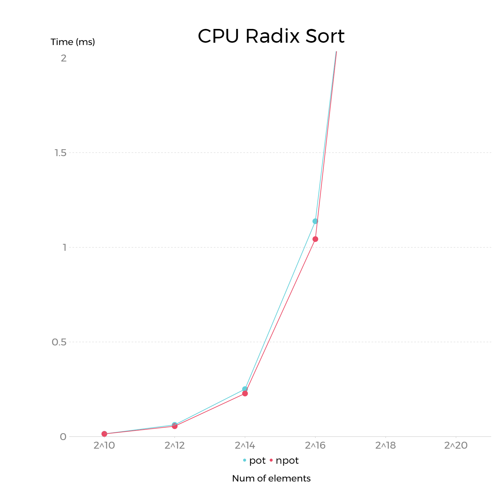

CUDA Stream Compaction
======================

**University of Pennsylvania, CIS 565: GPU Programming and Architecture, Project 2**

* Shutong Wu
  * [LinkedIn](https://www.linkedin.com/in/shutong-wu-214043172/)
  * [Email](shutong@seas.uepnn.edu)
* Tested on: Windows 10, i7-10700K CPU @ 3.80GHz, RTX3080, SM8.6, Personal Computer 

## GPU Scan and Stream Compaction
Implementation including:
- CPU Version of Scan
- CPU Version of Compact with Scan and without Scan
- GPU Naive Version
- GPU Work-Efficient Scan(UpSweep and DownSweep)
- GPU Work-Effient Compact
- CUDA Thrust Library Scan and Compaction
- Radix Sort(Extra Credit)
- TODO: Shared Memory Optimization/Warp Partitioning(Index Optimization)

## Performance Analysis
- We use runtime to measure the performance of each version of scan/compaction, the less time it took to run, the better the performance.
- We will test with arrays that have sizes from 2^8 to 2^19, and compare the performances of different types of scans and compacts
- All number varies from 0 to 99, and the run time is mesasured in ms;
- NPOT in the following charts means Non Power of Two
- BlockSize at 128

### Performance Analysis of Scan


- In the Scan process with normal size of arrays, CPU performs way better than GPU, no matter GPU is using naive scan or work efficient scan
- When array size gets really large(more than 100K), GPU naive scan performs better than CPU(perheps because of parallelism's advantage towards massive work), and GPU work efficient scan has the second best performance, while CPU has the worst performance with a huge size of array(like 2^22)
- There is no clear difference for the same method if we use array that has a power of two size or Non-Power-Of-Two size. Because in our GPU method we pad NPOT arrays to power-of-two arrays, and in CPU few elements would not cause a obvious difference.
- Thrust Scan has the best performance over other method: it requires less runtime and its performance does not increase when arraySize increases

### Performance Analysis of Compaction

- For a small size of array, GPU computation is slower than CPU, but for large size GPU run better than CPU, the best performance over all is GPU-Work Efficient Scan, and the worst is CPU-Compact With Scan(since we are including the time doing scan so this is the slowest)
- Scan for CPU in general is not a good choice because there are extra allocating work and heavy computation task for CPU when facing a large size of array; using GPU and especially work efficient scan is fast both in real task and in time complexity theoritically. It can be faster when using shared memory, which I will mention later.


### Performance Analysis of Radix Sort

- Implemented using the method on GPU Gem 
- So for this one I do comparison only to see if the sorted result matched together(and they did!)
- ThrustSort only took very little time to sort and does not increase time when arraySize increases, while RadixSort's runtime increases when array becomes larger


### Why is My GPU Approach So Slow?
- The main reason why our GPU is slower than CPU is because all computation uses global memory in GPU. Getting data from global memory is costly in terms of performance(Even though when facing large size of array parallelism become GPU's biggest advantage over CPU). The way to optimize it is to use shared memory instead of global and use an algorithm that reduces bank conflicts. (TODO)
- When executing kernel function, our current method/code will leave a lot of separate data thus cost warp divergence and performance lag. The way to optimize it is to use warp partitioning and a new way of reduction(change index mostly).(TODO)

### Bloopers
- So there are two things I would like to address specifically, one is using Pow instead of << in scan will result in array difference, and the other one is using std::swap instead of cudaMemCpy will also do that. These two errors will only occur with arraySize bigger than 1>>10, so I would assume it is a memory problem or precision problem? I will ask that in class I think. 


### Printout Example for 2^15 Array
```
****************
** SCAN TESTS **
****************
    [  55  43  82  26  65  61   2  23  78  35  86  32  58 ...  15   0 ]
==== radix sort, power-of-two ====
   elapsed time: 2.2528ms    (CUDA Measured)
    [   0   0   0   0   0   0   0   0   0   0   0   0   0 ...  99  99 ]
==== radix sort, non-power-of-two ====
   elapsed time: 2.66957ms    (CUDA Measured)
    [   0   0   0   0   0   0   0   0   0   0   0   0   0 ...  99  99 ]
==== radix sort, thrust power of two ====
   elapsed time: 0.001024ms    (CUDA Measured)
    [   0   0   0   0   0   0   0   0   0   0   0   0   0 ...  99  99 ]
==== radix sort, thrust non power of two ====
   elapsed time: 0.001024ms    (CUDA Measured)
    [   0   0   0   0   0   0   0   0   0   0   0   0   0 ...  99  99 ]
==== cpu scan, power-of-two ====
   elapsed time: 0.0398ms    (std::chrono Measured)
    [   0  55  98 180 206 271 332 334 357 435 470 556 588 ... 1626132 1626147 ]
==== cpu scan, non-power-of-two ====
   elapsed time: 0.0397ms    (std::chrono Measured)
    [   0  55  98 180 206 271 332 334 357 435 470 556 588 ... 1625941 1625974 ]
    passed
==== naive scan, power-of-two ====
   elapsed time: 0.078848ms    (CUDA Measured)
    [   0  55  98 180 206 271 332 334 357 435 470 556 588 ... 1626132 1626147 ]
    passed
==== naive scan, non-power-of-two ====
   elapsed time: 0.079872ms    (CUDA Measured)
    passed
==== work-efficient scan, power-of-two ====
   elapsed time: 0.099328ms    (CUDA Measured)
    [   0  55  98 180 206 271 332 334 357 435 470 556 588 ... 1626132 1626147 ]
    passed
==== work-efficient scan, non-power-of-two ====
   elapsed time: 0.099328ms    (CUDA Measured)
    [   0  55  98 180 206 271 332 334 357 435 470 556 588 ... 1625941 1625974 ]
    passed
==== thrust scan, power-of-two ====
   elapsed time: 0.031744ms    (CUDA Measured)
    [   0  55  98 180 206 271 332 334 357 435 470 556 588 ... 1626132 1626147 ]
    passed
==== thrust scan, non-power-of-two ====
   elapsed time: 0.028928ms    (CUDA Measured)
    [   0  55  98 180 206 271 332 334 357 435 470 556 588 ... 1625941 1625974 ]
    passed

*****************************
** STREAM COMPACTION TESTS **
*****************************
    [   3   3   2   2   1   1   2   3   2   3   2   0   2 ...   3   0 ]
==== cpu compact without scan, power-of-two ====
   elapsed time: 0.0608ms    (std::chrono Measured)
    [   3   3   2   2   1   1   2   3   2   3   2   2   1 ...   3   3 ]
    passed
==== cpu compact without scan, non-power-of-two ====
   elapsed time: 0.0593ms    (std::chrono Measured)
    [   3   3   2   2   1   1   2   3   2   3   2   2   1 ...   1   3 ]
    passed
==== cpu compact with scan ====
   elapsed time: 0.1069ms    (std::chrono Measured)
    [   3   3   2   2   1   1   2   3   2   3   2   2   1 ...   3   3 ]
    passed
==== work-efficient compact, power-of-two ====
   elapsed time: 0.115712ms    (CUDA Measured)
    [   3   3   2   2   1   1   2   3   2   3   2   2   1 ...   3   3 ]
    passed
==== work-efficient compact, non-power-of-two ====
   elapsed time: 0.108544ms    (CUDA Measured)
    [   3   3   2   2   1   1   2   3   2   3   2   2   1 ...   1   3 ]
    passed
Press any key to continue . . .
```
