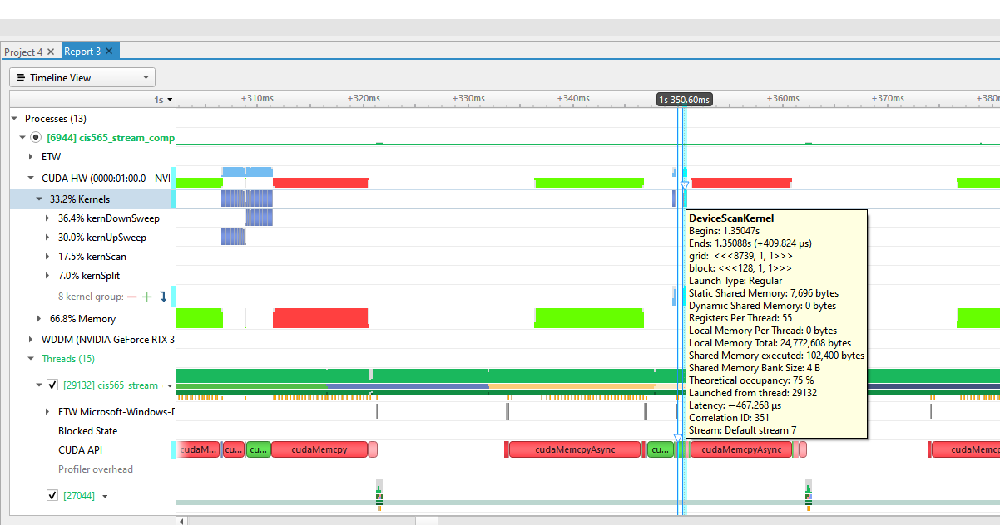

CUDA Stream Compaction
======================

**University of Pennsylvania, CIS 565: GPU Programming and Architecture, Project 2**

* Yu-Chia Shen
  * [LinkedIn](https://www.linkedin.com/in/ycshen0831/)
* Tested on: Windows 10, i5-11400F @ 4.3GHz 16GB, GTX 3060 12GB (personal)

## Overview

This project includes 3 implementations of GPU parallel algorithms, **Scan**, **Stream Compaction**, and **Radix Sort**. Each implementations has several versions for performance comparison.

### Scan  
Performs an All-Prefix-Sum to an array.
* **CPU Scan**: Serialized computation over the array. 
* **GPU Naive Scan**: Parallelized exclusive sum.
* **GPU Efficient Scan**: Opimized parallelized exclusive sum. Use a balanced binary tree to perform two phase
  * Up-Sweep (Parallel Reduction)
  * Down-Sweep - Merge partial sums to build scan in place.
* **Thrust Implementaion**: A C++ template library for CUDA based on the Standard Template Library (STL).

### Stream Compaction 
Remove all the 0s from an array. 
* **CPU Compaction**: Serialized computation over the array. 
* **CPU Compaction with Scan**: Serialized computation using CPU scan. 
* **GPU Stream Compaction**: Parallelized computation with 3 steps
  * Map - Identify every 0s in the array
  * Scan - Claculate indices for non-0 elements.
  * Scatter - Write non-0 elements to correct positions.


### Radix Sort (Extra Credit)
Sort the array using partitions that based on one bit.
* **Thrust Implementation**: A C++ template library that is used as comparison.
* **GPU Radix Sort**: Parallelized computation with 3 steps for every bits. 
  * Bit Mapping - From least significant bit to most significant bit, identify a bit mask for current bit.
  * Scan - Perform scan over the bit mask.
  * Split - Partition based on current bit.
  
## Radix Sort (Extra Credit)
### Usage
`StreamCompaction::Efficient::radixSort(Size, output, input)`

### Result
```
**********************
** RADIX SORT TESTS **
**********************
    [  45  23   3  11  27  32  15  29   1  47  29   3  22 ...  11   0 ]
==== Thrust sort, power-of-two ====
   elapsed time: 0.00176ms    (CUDA Measured)
    [   0   0   0   0   0   0   0   0   0   0   0   0   0 ...  49  49 ]
==== Radix Sort, power-of-two ====
   elapsed time: 74.6997ms    (CUDA Measured)
    [   0   0   0   0   0   0   0   0   0   0   0   0   0 ...  49  49 ]
    passed
==== Thrust sort, non-power-of-two ====
   elapsed time: 0.00192ms    (CUDA Measured)
    [   0   0   0   0   0   0   0   0   0   0   0   0   0 ...  49  49 ]
==== Radix Sort, non-power-of-two ====
   elapsed time: 42.6619ms    (CUDA Measured)
    [   0   0   0   0   0   0   0   0   0   0   0   0   0 ...  49  49 ]
    passed
```

## Performance Analysis

### Execution Time for Scan (Lower is Better)

_Figure 1: Scan Performance Comparison_

As Figure 1 shows, we have the following conclusions:
* __CPU Scan__: The worst version of scan. Serialized travel every elements will have a long runtime.
* __GPU Naive Scan__: This version is slightly better than CPU version, but still has a long runtime.
* __GPU Efficient Scan__: By using a balance binary tree for optimization, this version reduces almost half of the runtime. However, there is still performance bottlenecks. Due to the frequent access to the global memory, the runtime still increases significantly when the size of array is large. 

  A solution is to use shared memory to replace the global memory. This will greatly improve the performance.
* __Thrust Implementation__:

_Figure 2: Thrust Analysis with NSight_

  As Figure 2 shows, Thrust has the following improvements:
  * __Memory Allocation__: In the function `DeviceScanKernel`, there are 7696 bytes of Static Shared Memory. Using the shared memory can greatly reduce the memory access time.

  * __Memory Copy Method__: The memory copy method used in Thrust is `cudaMemcpyAsync`. Unlike `cudaMemcpy` will block the host thread, `cudaMemcpyAsync` is non-blocking on the host. Therefore, host can transfer data concurrently, and thus is faster than `cudaMemcpy`. 

## Sample Output

```
Using SIZE: 16 M
****************
** SCAN TESTS **
****************
    [  38  44  42   2  16  46  40  33  46  25  24  15  12 ...  39   0 ]
==== cpu scan, power-of-two ====
   elapsed time: 27.3899ms    (std::chrono Measured)
    [   0  38  82 124 126 142 188 228 261 307 332 356 371 ... 410934036 410934075 ]
==== cpu scan, non-power-of-two ====
   elapsed time: 27.4172ms    (std::chrono Measured)
    [   0  38  82 124 126 142 188 228 261 307 332 356 371 ... 410933976 410933979 ]
    passed
==== naive scan, power-of-two ====
   elapsed time: 11.4565ms    (CUDA Measured)
    [   0  38  82 124 126 142 188 228 261 307 332 356 371 ... 410934036 410934075 ]
    passed
==== naive scan, non-power-of-two ====
   elapsed time: 11.6449ms    (CUDA Measured)
    [   0  38  82 124 126 142 188 228 261 307 332 356 371 ... 410933976 410933979 ]
    passed
==== work-efficient scan, power-of-two ====
   elapsed time: 4.9359ms    (CUDA Measured)
    [   0  38  82 124 126 142 188 228 261 307 332 356 371 ... 410934036 410934075 ]
    passed
==== work-efficient scan, non-power-of-two ====
   elapsed time: 4.6543ms    (CUDA Measured)
    [   0  38  82 124 126 142 188 228 261 307 332 356 371 ... 410933976 410933979 ]
    passed
==== thrust scan, power-of-two ====
   elapsed time: 0.569056ms    (CUDA Measured)
    [   0  38  82 124 126 142 188 228 261 307 332 356 371 ... 410934036 410934075 ]
    passed
==== thrust scan, non-power-of-two ====
   elapsed time: 0.72192ms    (CUDA Measured)
    [   0  38  82 124 126 142 188 228 261 307 332 356 371 ... 410933976 410933979 ]
    passed

*****************************
** STREAM COMPACTION TESTS **
*****************************
    [   3   3   0   0   1   1   1   0   0   1   2   1   1 ...   2   0 ]
==== cpu compact without scan, power-of-two ====
   elapsed time: 36.8856ms    (std::chrono Measured)
    [   3   3   1   1   1   1   2   1   1   2   2   1   2 ...   3   2 ]
    passed
==== cpu compact without scan, non-power-of-two ====
   elapsed time: 36.297ms    (std::chrono Measured)
    [   3   3   1   1   1   1   2   1   1   2   2   1   2 ...   2   1 ]
    passed
==== cpu compact with scan ====
   elapsed time: 74.6997ms    (std::chrono Measured)
    [   3   3   1   1   1   1   2   1   1   2   2   1   2 ...   3   2 ]
    passed
==== work-efficient compact, power-of-two ====
   elapsed time: 6.25254ms    (CUDA Measured)
    [   3   3   1   1   1   1   2   1   1   2   2   1   2 ...   3   2 ]
    passed
==== work-efficient compact, non-power-of-two ====
   elapsed time: 6.69901ms    (CUDA Measured)
    [   3   3   1   1   1   1   2   1   1   2   2   1   2 ...   2   1 ]
    passed

**********************
** RADIX SORT TESTS **
**********************
    [  45  23   3  11  27  32  15  29   1  47  29   3  22 ...  11   0 ]
==== Thrust sort, power-of-two ====
   elapsed time: 0.00176ms    (CUDA Measured)
    [   0   0   0   0   0   0   0   0   0   0   0   0   0 ...  49  49 ]
==== Radix Sort, power-of-two ====
   elapsed time: 74.6997ms    (CUDA Measured)
    [   0   0   0   0   0   0   0   0   0   0   0   0   0 ...  49  49 ]
    passed
==== Thrust sort, non-power-of-two ====
   elapsed time: 0.00192ms    (CUDA Measured)
    [   0   0   0   0   0   0   0   0   0   0   0   0   0 ...  49  49 ]
==== Radix Sort, non-power-of-two ====
   elapsed time: 42.6619ms    (CUDA Measured)
    [   0   0   0   0   0   0   0   0   0   0   0   0   0 ...  49  49 ]
    passed
Press any key to continue . . .
```